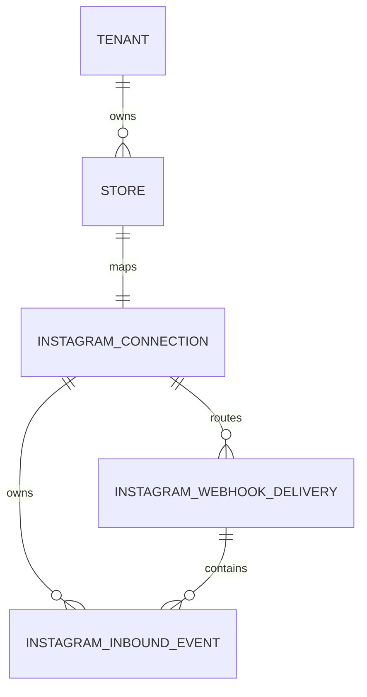
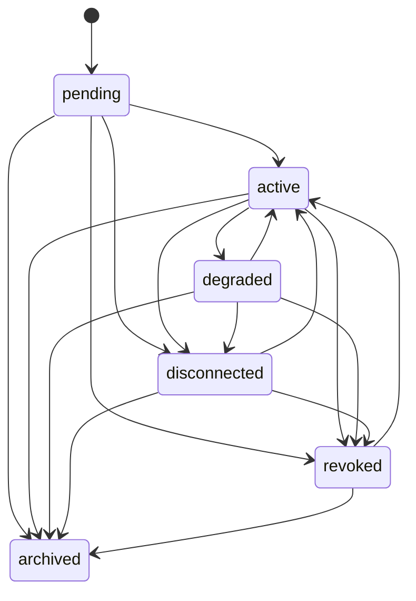
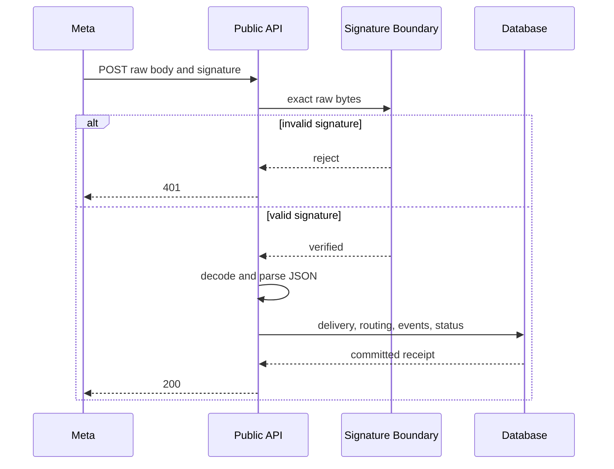
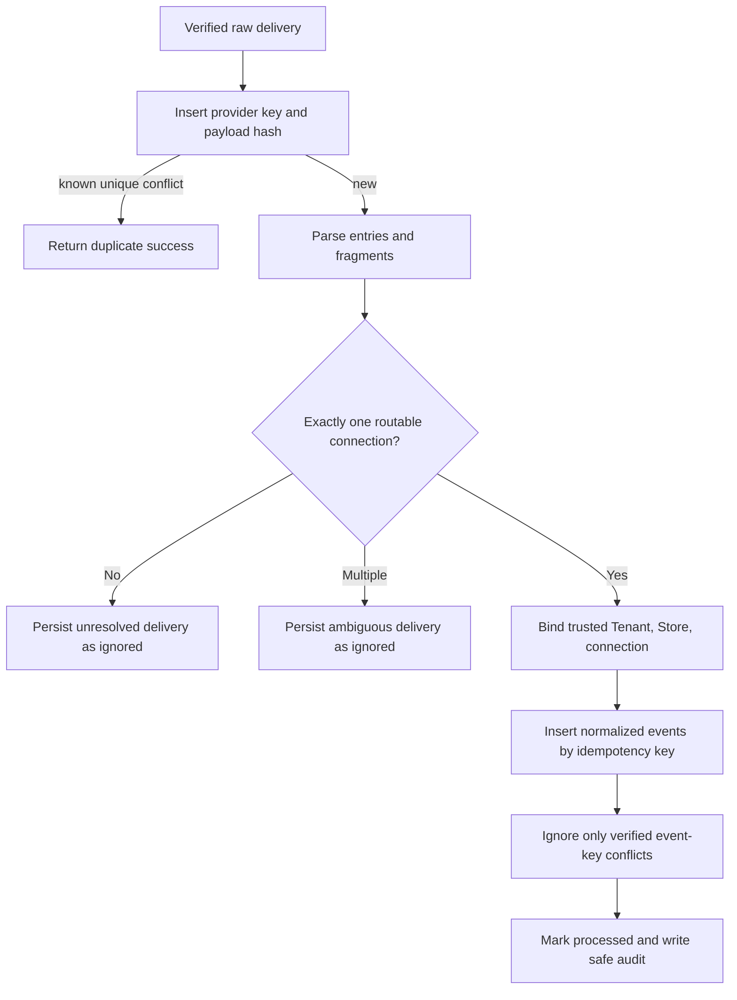

# Instagram Channel Integration Foundation

## Objective and boundaries

FOUNDATION-08 establishes DirectPilot's production-oriented Instagram
connectivity and inbound webhook boundary. An authorized Store member can
register one Instagram professional account, configure an encrypted access
token, activate or disconnect the mapping, and inspect bounded delivery and
normalized-event diagnostics. Meta can verify the public subscription endpoint
and submit signed webhook payloads.

This Foundation only receives, authenticates, routes, stores, and normalizes
transport events. It does not call Meta outbound APIs, send replies, create
conversations, call AI models, retrieve knowledge, create leads or orders,
perform billing or analytics, or introduce queues or other channels.

The legacy `/webhooks/instagram` development flow remains for regression
compatibility. The new boundary is isolated under `app/instagram_channel` and
`/api/v1/integrations/instagram/webhook`.

## Domain and ownership



`InstagramConnection` belongs to exactly one Tenant and Store. Composite
constraints enforce `(store_id, tenant_id)`. A Store has at most one connection
record, and Instagram account and Facebook Page identifiers are globally
unique. The conservative uniqueness rule prevents ambiguous cross-tenant
routing.

`InstagramWebhookDelivery` represents one verified HTTP request. It stores the
raw JSON once for deterministic replay, provider diagnostics, and future
normalization recovery. Ownership is null until a trusted persisted connection
is resolved; the database requires all three ownership values to be null or all
three to be present.

`InstagramInboundEvent` is a normalized transport event extracted from a
delivery. It always has a resolved connection, Tenant, and Store. Supported
classifications are `messaging`, `comments`, and `unsupported`; these are not
conversation or sales semantics. Internal numeric keys never leave the
service. REST resources use opaque public IDs.

## Connection lifecycle



Activation is a local readiness transition. It requires encrypted credentials
and records `last_verified_at`, but does not claim that Meta accepted the
credential. `active` and `degraded` are routable. `pending`, `disconnected`,
`revoked`, and `archived` never receive tenant events. Archived records are
immutable and have no restoration endpoint.

All management mutations require `expected_revision`. Explicit comparisons and
SQLAlchemy optimistic version checks reject stale writes.

## Token encryption

`FernetTokenCipher` implements the replaceable `TokenCipher` protocol with the
maintained `cryptography` package. Fernet provides authenticated symmetric
encryption; custom cryptography is not used.

The key comes from `INSTAGRAM_TOKEN_ENCRYPTION_KEY` or
`INSTAGRAM_TOKEN_ENCRYPTION_KEY_FILE` and must be a URL-safe base64-encoded
32-byte Fernet key. Credential mutation fails closed when the key or dependency
is unavailable. Deployed configuration validation rejects invalid keys, while
application import and non-credential local operation remain available.

Only ciphertext is stored. APIs expose `token_configured`, type, expiry, scopes,
and update time. Plaintext, ciphertext, partial tokens, app secrets, and verify
tokens are excluded from responses, audit details, and logs.

```powershell
python -c "from cryptography.fernet import Fernet; print(Fernet.generate_key().decode())"
```

Key rotation across existing ciphertext requires a future explicit
re-encryption procedure.

## Public webhook security

`GET /api/v1/integrations/instagram/webhook` requires Meta mode `subscribe`, a
non-empty challenge, and a constant-time match with `META_VERIFY_TOKEN`. It
returns the challenge exactly as plain text. Invalid requests return a generic
403 and missing configuration returns 503.

`POST /api/v1/integrations/instagram/webhook` reads the exact raw bytes before
JSON decoding. It validates `X-Hub-Signature-256` with HMAC-SHA256 and
`META_APP_SECRET`, using constant-time digest comparison. Missing, malformed,
or invalid signatures return 401 before payload acceptance. Validly signed
invalid JSON returns 400.



The public endpoint accepts no Tenant or Store selector. Ownership comes only
from persisted `instagram_account_id` or `facebook_page_id` mappings.

## Ingestion and idempotency



Delivery deduplication uses the provider delivery key when available and an
exact-body SHA-256 hash. Both have database unique constraints. A savepoint
handles a unique conflict as a retry only when the matching persisted key or
hash is found; unrelated integrity failures are re-raised.

Events use provider message/comment IDs plus stable attributes, with a
deterministic fragment fallback. The database enforces
`(provider, idempotency_key)`. Distinct deliveries containing the same provider
event create one normalized event. Duplicate authenticated requests return 200.

A delivery spanning multiple resolved connection scopes is stored as
`ambiguous_account_scope` and creates no events. Unknown and non-routable
accounts remain unresolved and never fall back to a default Tenant.

## Parser

The pure parser supports multiple entries, multiple messaging/change records,
messages, comments, unsupported fields, and malformed fragments. Order is
preserved. A bad fragment becomes an `unsupported` diagnostic when routable and
does not corrupt valid siblings. No content is treated as an instruction and
no product, customer, intent, conversation, or AI semantics are applied.

## Management API and permissions

All authenticated paths start with:

```text
/api/v1/tenants/{tenant_public_id}/stores/{store_public_id}/instagram-channel
```

| Method and path | Permission | Result |
|---|---|---|
| `POST /connections` | `instagram_connection.manage` | Register pending mapping |
| `GET /connections` | `instagram_connection.read` | Bounded Store list |
| `GET /connections/{id}` | `instagram_connection.read` | Safe metadata |
| `PATCH /connections/{id}` | `instagram_connection.manage` | Metadata update |
| `POST /connections/{id}/token` | `instagram_connection.credentials.manage` | Encrypt/replace token |
| `POST /connections/{id}/activate` | `instagram_connection.manage` | Local readiness transition |
| `POST /connections/{id}/disconnect` | `instagram_connection.manage` | Stop routing |
| `POST /connections/{id}/archive` | `instagram_connection.manage` | Terminal state |
| `GET /connections/{id}/deliveries[/{delivery_id}]` | `instagram_webhook.read` | Safe diagnostics |
| `GET /connections/{id}/events[/{event_id}]` | `instagram_event.read` | Normalized events |

Lists default to 25, cap at 100, and use deterministic newest-first ordering.
Raw payloads, encrypted credentials, secrets, headers, and internal IDs are
omitted. Cross-tenant, unassigned-Store, missing-permission, and unknown public
IDs use the existing safe not-found boundary.

| Role | Read | Manage | Credentials | Webhooks | Events |
|---|---:|---:|---:|---:|---:|
| Tenant owner/admin | yes | yes | yes | yes | yes |
| Store manager | yes | yes | yes | yes | yes |
| Tenant operator | yes | yes | no | yes | yes |
| Content manager, analyst, viewer | yes | no | no | yes | yes |
| Operator/read-only | yes | no | no | yes | yes |

Provider platform access continues through explicit `tenant.read` and
`tenant.update`. General lifecycle management never implies credential access.

## Audit, logging, and privacy

Tenant audit covers connection creation/update, credential rotation,
activation, disconnection, archival, accepted resolved delivery, and resolved
duplicate retry. Records contain public connection and safe state metadata.

Signature rejection, invalid JSON, unresolved routing, duplicate
classification, and unexpected failures emit structured event codes. A
signature rejection cannot be assigned to a Tenant before trusted routing, so
it remains an operational security event. Logs never include bodies, message
content, secrets, signatures, tokens, ciphertext, or verification challenges.

The exact JSON payload is stored once because replay and normalization recovery
require it. Normalized events retain only the supported routing, timestamp,
classification, provider ID, and content fields. Raw payloads are never exposed
by management APIs and headers are not persisted. Time/status/ownership indexes
provide a future retention seam; no retention worker is implemented.

## Transactions and failure behavior

One in-process transaction owns delivery insertion, routing, event creation,
connection last-received update, status, and resolved audit. Savepoints isolate
expected delivery/event unique conflicts. Invalid top-level structure is stored
as a failed verified delivery. Unexpected database failures roll back rather
than leaving a misleading processed state.

No background worker, retry scheduler, Redis, RabbitMQ, Celery, Kafka, or
external service is introduced.

## Migration and validation

`0008_instagram_channel` follows `0007_business_profile_knowledge` and creates:

- `instagram_connections`;
- `instagram_webhook_deliveries`;
- `instagram_inbound_events`.

It includes public-ID indexes, composite ownership foreign keys, finite status
checks, Store/account routing uniqueness, delivery key/hash uniqueness, event
idempotency uniqueness, and Tenant/Store/time diagnostic indexes. Downgrade
removes only these tables in dependency order.

Automated validation covers lifecycle, stale writes, uniqueness, public schema,
audit redaction, encryption, missing keys, RBAC, tenant isolation, verification,
exact-byte HMAC, invalid JSON, parsing, routing, both dedupe levels, migration
structure, seed idempotency, app/OpenAPI generation, and repository regression.
No live Meta account, credential, or network is required.

## Future seam and known limitations

`instagram_inbound_events` is the only approved seam for a future conversation
Foundation. Consumers must not infer that an event was answered.

Known limitations:

- activation checks local readiness only;
- no outbound send, conversation, inbox, handoff, AI, or retrieval;
- one persistent connection per Store and globally unique account/Page
  mappings; archived mappings are not reusable;
- multi-connection HTTP deliveries are ignored;
- no automated payload retention or credential-key re-encryption;
- synchronous in-process processing only;
- no live PostgreSQL or Meta validation is claimed by offline tests.
