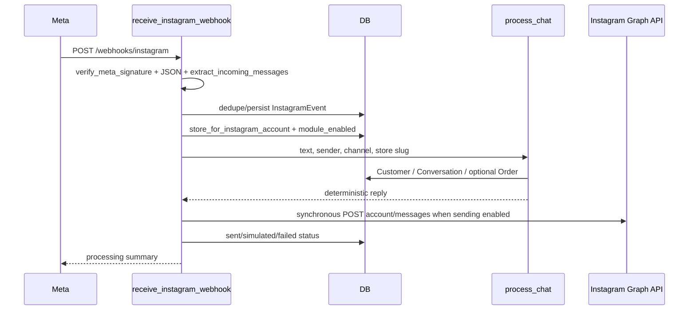
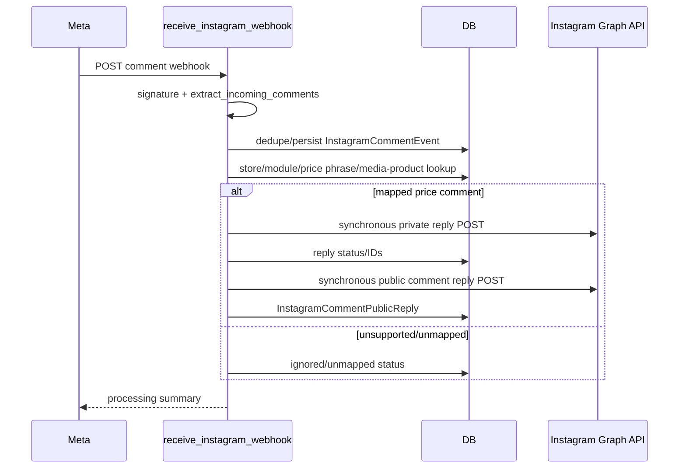
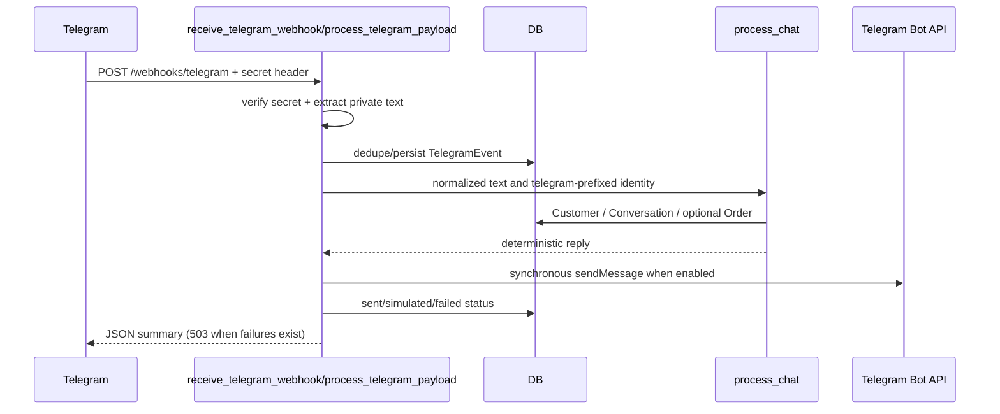
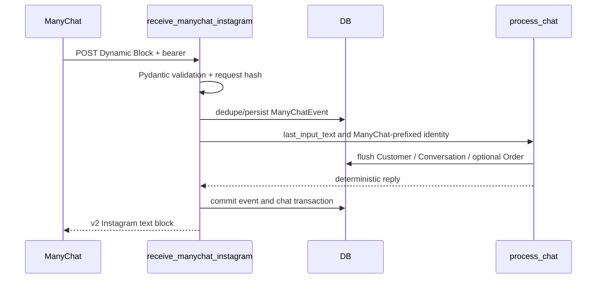

# AUDIT-01 — Current Integration Flows

All four integrations call `app/chat.py::process_chat()`, which is deterministic; no LLM or AI provider call occurs.

## A. Instagram inbound message

Evidence: `app/instagram.py::receive_instagram_webhook()`, `extract_incoming_messages()`, `deliver_response()`, `InstagramClient.send_text()`; persistence models are `InstagramEvent`, `Customer`, `Conversation`, and optional `Order`. Echo/self/deleted/non-text/empty messages are skipped. The outbound `httpx` call is awaited inside webhook processing.

## B. Instagram comment

Evidence: `app/instagram.py::extract_incoming_comments()`, `is_price_comment()`, `deliver_comment_response()`, `ensure_public_comment_reply()`, and `InstagramClient.send_private_reply()/send_public_comment_reply()`. Product selection uses `InstagramMediaProduct`; comments do not call `process_chat()`.

## C. Telegram inbound message

Evidence: `app/telegram.py::receive_telegram_webhook()`, `extract_incoming_messages()`, `process_telegram_payload()`, `deliver_response()`, and `TelegramClient.send_text()`. Alternative local polling is `app/telegram_polling.py::run_polling()`, which synchronously long-polls `getUpdates` before passing each update to the same processor. Groups, channels, bots, edited messages, and media are ignored.

## D. ManyChat inbound message

Evidence: `app/manychat.py::require_manychat_bearer()`, `manychat_request_key()`, and `receive_manychat_instagram()`. There is no outbound provider network call inside this handler; ManyChat receives the HTTP response and performs channel delivery. Failed events retain only a safe error type and may be retried.

## Flow-level Needs Verification

- **Needs Verification:** provider timeout budgets and production retry behavior are not configured in repository deployment assets; all shown outbound calls are currently in-process.

