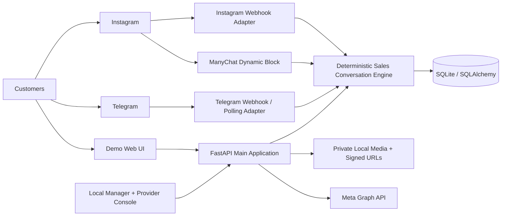
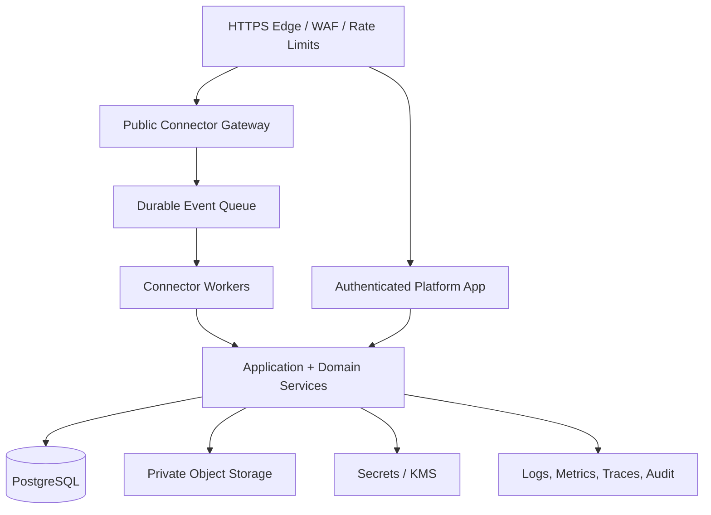
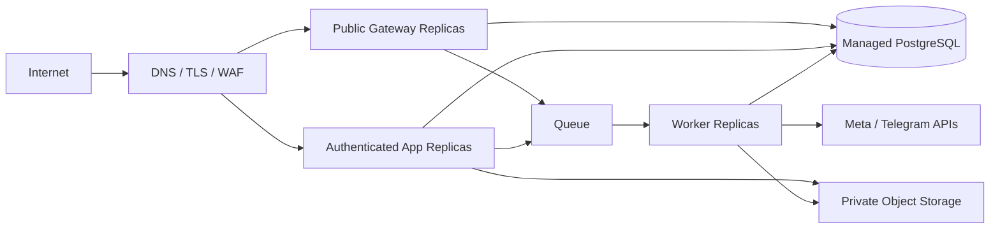
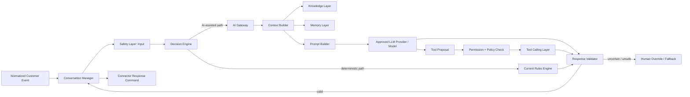
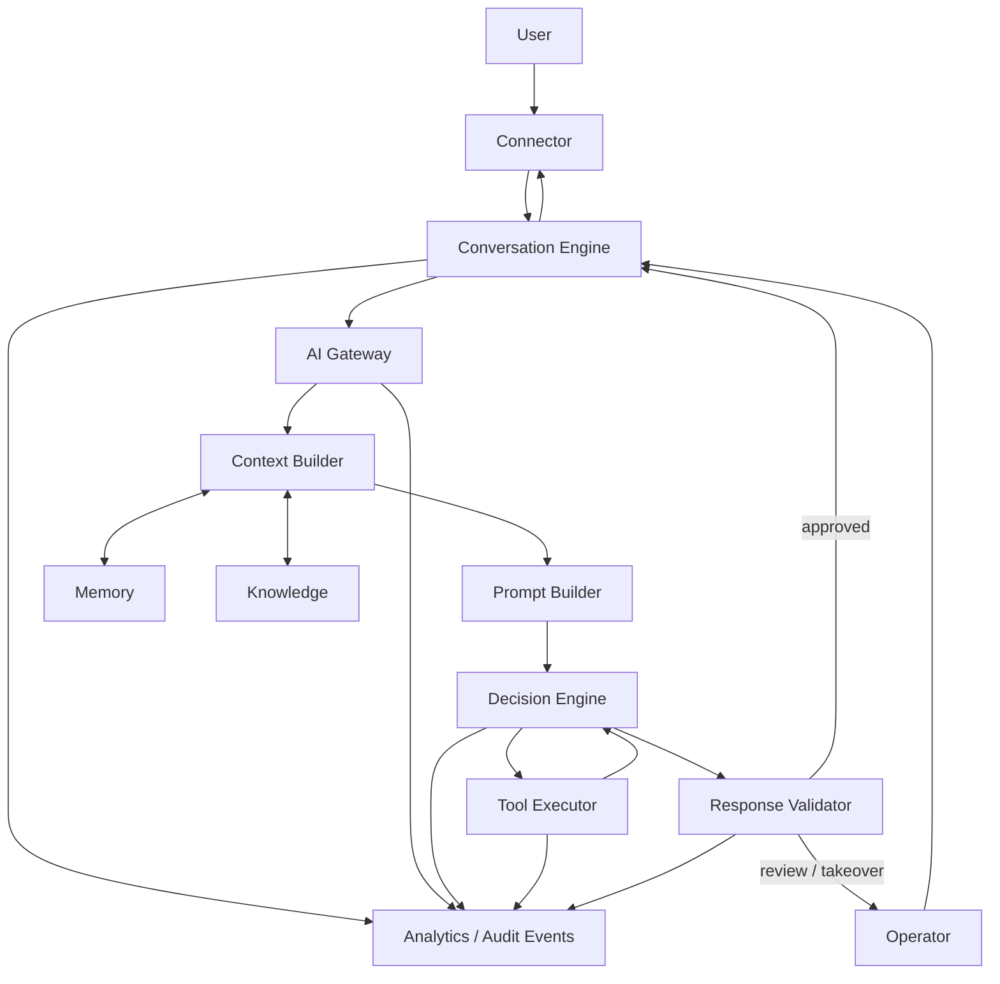
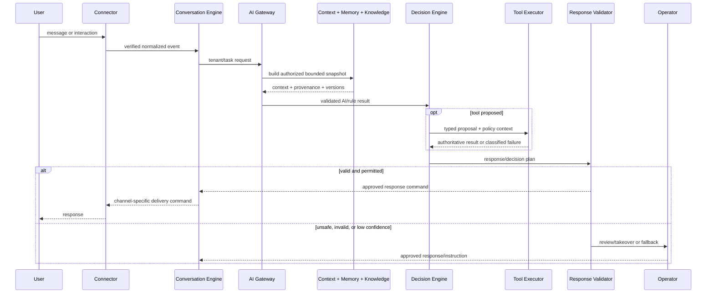

# DirectPilot — Product and Architecture Blueprint

> **Repository:** DirectPilot (currently hosted as `namach2727-coder/Sales-Agent`)
> **Document status:** Canonical product, SaaS, and target-state architecture
> **Repository assessment date:** 2026-07-28
> **Blueprint revision:** `2.0` — DirectPilot product and SaaS guardrails
> **Authority:** This document is the single source of truth for product and architecture decisions until superseded by a reviewed revision.

## Document conventions

This blueprint distinguishes implemented behavior from intended architecture. A **Target State** is a direction, not a claim that the capability exists. **Gap** describes the difference. **Migration Strategy** defines a safe route from the current repository to the target without prescribing unapproved application code.

The words **MUST**, **SHOULD**, and **MAY** are normative. Repository evidence is referenced with paths relative to the repository root. The DirectPilot guardrails below take precedence over older target-state discussion whenever a conflict exists. Historical audit documents remain evidence of repository state at the time they were written, not current product policy.

## DirectPilot product and SaaS architecture guardrails

This section is normative. It distinguishes **already implemented**, **current
scope**, **planned**, and **deferred** capabilities. Documentation of a future
capability does not authorize or imply its implementation.

### 1. Product identity

DirectPilot helps Instagram businesses automate customer conversations and turn
comments and direct messages into measurable outcomes using AI. It is an AI
Sales Assistant, a business-specific AI employee, a conversion-oriented
assistant, and a multi-tenant SaaS platform. It is not a generic chatbot,
keyword bot, Instagram script, full MVP CRM, or multi-channel MVP. Positioning:

> **Connect your page; your AI admin is ready.**

DirectPilot MUST behave like an employee trained on the specific business and
MUST answer from approved business knowledge rather than fabricate.

### 2. Business outcomes

Each major feature SHOULD improve lead, order, booking, or consultation
requests; conversion or retention; operator workload; or response reliability.
Message volume alone is not the primary outcome. A proposal that improves none
of these and is not required for security or reliability normally stays in the
backlog.

### 3. Fixed MVP boundaries

The production MVP has one channel: **Instagram through official Meta APIs**.
Scope is account connection, webhooks, comments, direct messages, automatic or
suggested replies, and human handoff. WhatsApp, Telegram, email, multi-channel
inbox, CRM integration, and complete marketing automation are excluded. Legacy
development connectors in the repository are not DirectPilot MVP scope and
MUST NOT be extended without a later approved foundation. Future adapter
boundaries may be anticipated but not implemented prematurely.

### 4. Multi-tenancy

DirectPilot is multi-tenant from its first release. Users/memberships, Instagram
connections, settings, catalog, products/services, automations, knowledge,
conversations, usage, subscriptions, analytics, and audit data are tenant owned
or isolated. Every tenant-bound query and mutation MUST be scoped. Cross-tenant
references are forbidden. Tenant identity comes from trusted authentication and
membership context, never unrestricted request input.

### 5. Scalability objective

The core domain architecture should support growth from 10 to 100, 1,000, and
eventually 10,000 tenants without replacement. This is a design objective, not
a load-test claim. Readiness comes from stateless APIs, explicit modules,
tenant-scoped indexes, pagination, idempotent webhooks, replaceable providers,
containers, external configuration, migration discipline, horizontal-scaling
compatibility, controlled background work, and observability boundaries. MVP
does not require enterprise-scale infrastructure.

### 6. Architecture style

The current architecture is a **Modular Monolith**: it favors delivery speed,
simple operations, transactional clarity, local development, lower cost, and
adequate early scalability. Modules communicate through explicit application
interfaces and existing in-process event patterns where applicable.
Microservices are deferred until demonstrated load, reliability, deployment, or
team boundaries justify extraction. Channel ingestion, AI processing,
analytics, billing, and notifications are possible future candidates only.

### 7. Cloud readiness

The MVP may begin on local Windows but remains deployable to Azure, AWS,
DigitalOcean, or another container platform. Requirements are existing
settings/environment configuration, no machine-specific paths, Docker
readiness, PostgreSQL support, replaceable storage, stateless API processes
where practical, encrypted external tokens, health checks, structured logs,
and migration-based deployment. No cloud service is mandated now.

### 8. Configuration over hardcoding

Business variation SHOULD use profiles, capabilities, templates, knowledge,
policies, entitlements, and configuration instead of duplicated applications or
industry condition trees. Configuration cannot replace explicit validation for
security, money, isolation, quotas, or sensitive-topic controls.

### 9. Current technical stack

- **Backend:** Python, FastAPI, SQLAlchemy, and Alembic.
- **Database:** PostgreSQL for deployment; temporary SQLite only where already
  used for tests or migration validation.
- **Architecture:** Modular Monolith, REST, versioned APIs, established FastAPI
  dependency injection, and current repository/service conventions.
- **Security boundary:** existing authentication, permission checks, tenant
  membership, public UUID-style API identifiers, and internal numeric IDs.

React, Next.js, Redis, RabbitMQ, S3, and any cloud vendor are not implemented
unless repository evidence says otherwise. DirectPilot MUST NOT be rewritten to
ASP.NET Core, Entity Framework Core, or microservices because of generic advice.

### 10. Infrastructure readiness

- Add cache abstraction only for a validated use case; Redis is a possible
  future provider, not a current dependency.
- Introduce background/queue interfaces only when webhook, AI, or notification
  workloads require them; RabbitMQ is a possible future provider only.
- Keep storage replaceable; S3-compatible storage, Azure Blob, and MinIO are
  future options, not domain dependencies.
- Introduce workers only for demonstrated requirements.

### 11. Security

Permanent requirements are official Meta OAuth/API integration, never storing
Instagram passwords, encryption of external tokens, webhook signature
verification, duplicate-event prevention, permission-based authorization,
strict isolation, audit trails, rate-limit readiness, safe uploads, log
redaction, and no cross-tenant resource-existence leakage.

### 12. Free and paid business model

DirectPilot is subscription SaaS with future monthly/yearly billing and
usage-based compatibility. The **Forever Free** plan has one tenant, one
connected Instagram page, and one user unless later changed explicitly. It
allows **20 successful automatic replies per tenant calendar day**, resetting
in the tenant timezone, with no expiry or card requirement. Manual replies,
failed sends, unapproved Shadow Mode suggestions, and idempotent retries do not
consume quota.

Future paid direction may include higher limits, more automations/users/pages,
branding removal, richer catalog/media, analytics, advanced knowledge, API
access, and CRM integration. Documentation here does not put them in MVP scope.

### 13. Feature entitlement architecture

FOUNDATION-09B may introduce data-driven `Plan`, `PlanFeature`,
`TenantSubscription`, `UsageCounter`, and `UsageEvent` concepts. They MUST NOT
be implemented during FOUNDATION-06.

### 14. Marketing platform readiness

Future architecture should not block referrals, affiliates, promo/coupon codes,
campaign pages, UTM attribution, conversion events, SEO pages, A/B tests, or
campaign tracking. Attribution should use explicit events, not unrelated domain
aggregates. `Campaign`, `AttributionTouch`, `ReferralCode`, `Affiliate`,
`PromotionCode`, `Experiment`, `ExperimentVariant`, and `ConversionEvent` are
conceptual post-MVP items only; no models, tables, APIs, migrations, or services
are authorized now.

### 15. Analytics direction

Analytics should ultimately measure leads, order/booking/consultation requests,
handoffs, unanswered questions, automatic versus manual replies, conversion,
and quota usage. MVP MUST NOT create an event warehouse or separate analytics
platform. Operational events should remain usable by a future pipeline.

### 16. Observability and operations

Long-term requirements are structured logs, correlation IDs, audit logs, health
and readiness checks, error monitoring, metrics readiness, delivery tracking,
webhook diagnostics, and sensitive-data redaction. Implement only what an
approved foundation requires or what repository evidence shows already exists.

### 17. Architecture evolution rules

Before adding architecture or infrastructure, verify that it solves a validated
requirement, is needed for the next pilot/security/integrity, has evidence that
the current approach is insufficient, and cannot be handled more simply inside
the Modular Monolith. Future usefulness alone is not authorization.

### 18. Explicit non-goals for the current MVP

- no microservices, Kubernetes, Redis dependency, or RabbitMQ dependency;
- no complete CRM, billing, affiliate, coupon, A/B testing, website-builder, or
  advanced warehouse engine;
- no multi-channel inbox;
- no complete billing engine during FOUNDATION-06;
- no premature abstraction without a current use case.

### Accepted architecture decision — DirectPilot SaaS evolution strategy

**Status:** Accepted

**Context.** DirectPilot begins as an Instagram-first MVP and may evolve into an
AI Sales Automation Platform. A strategic proposal suggested ASP.NET Core,
Entity Framework Core, Redis, RabbitMQ, S3, microservices, marketing engines,
and a conflicting free quota. The application already uses FastAPI,
SQLAlchemy, Alembic, PostgreSQL, and a Modular Monolith.

**Decision.** Preserve the Python architecture and Modular Monolith; remain
cloud-ready and horizontally scalable; introduce provider boundaries only when
justified; remain queue-, cache-, and storage-provider-ready without adding
those providers now; keep Instagram as the sole MVP channel; retain 20
successful automatic replies per tenant day; document marketing direction
without implementation; extract modules only when real scale or team boundaries
justify it.

**Positive consequences.** No disruptive rewrite, faster delivery, lower cost,
controlled complexity, long-term extensibility, and consistent direction.

**Trade-offs.** Future providers still require implementation, module boundaries
require discipline, scale requires later load-test evidence, and future
requirements are intentionally not pre-built.

**Rejected alternatives.** Immediate ASP.NET Core rewrite, immediate
microservices, mandatory Redis/RabbitMQ/S3, complete MVP marketing engines, and
the conflicting 30-replies-per-month quota.

## Executive architecture baseline

The repository is a local-first FastAPI application with a deterministic shared sales engine, PostgreSQL deployment foundations, Alembic migrations, opaque-session authentication, permission-based RBAC, explicit Tenant/Store boundaries, legacy Instagram/Telegram/ManyChat adapters, catalog-training workflows, a local manager console, a content studio, and a database-backed module catalog. Repository presence does not automatically put a legacy or experimental adapter inside the DirectPilot MVP product scope.

Production SaaS readiness remains incomplete. Tenant/Store management, authentication, RBAC, migrations, integration/UAT configuration, health checks, and deployment runbooks exist; legacy commerce data paths, connector credential isolation, billing, MFA, durable background processing, and full production observability require later approved foundations.



---

## 1. Product Vision

### Current State

The repository delivers sales-assistant behavior that answers product and FAQ questions, recognizes Persian and common Finglish expressions, captures phone numbers, records pending orders, flags operator handoff, and responds to Instagram direct messages and price comments. Telegram, ManyChat, and the web demo also call the shared deterministic engine as legacy development surfaces; they are not DirectPilot MVP channels. A local manager can prepare catalog knowledge and reviewed social content (`app/admin.py`, `app/admin_content.py`).

### Target State

Provide DirectPilot as a secure, modular, multi-tenant Instagram AI Sales Assistant in which each store manages approved business knowledge, catalog, Instagram connection, conversation policy, and entitled capabilities through an isolated store console while the provider manages platform operations separately.

### Gap

The product value has been proven as a single-machine MVP, but tenant isolation, identity, production operations, billing, scalable connector execution, and true AI-assisted features are absent. The current response and content generation logic is deterministic; `OPENAI_API_KEY` exists in settings but no OpenAI client is used.

### Migration Strategy

Preserve the working sales workflows, introduce tenant context and identity before public SaaS exposure, then separate operational services only where load or security boundaries require it. Do not replace deterministic behavior until equivalent tests and fallback behavior exist.

### Recommendations

- Position the near-term product as a configurable commerce automation platform, not as autonomous general AI.
- Treat Instagram sales automation, catalog training, and manager-reviewed content as the initial product pillars.
- Make human review and operator escalation explicit product principles.

### Acceptance Criteria

- Product claims distinguish deterministic automation from AI-generated behavior.
- Every customer-facing capability maps to implemented code or an explicitly approved roadmap item.
- A store can be onboarded without source-code or database manipulation before external launch.
- No production launch occurs before the checklist in Chapter 24 is satisfied.

## 2. Product Scope

### Current State

Implemented scope includes demo chat, catalog/FAQ responses, lead and order capture, operator intent, Instagram DM and comment-to-private-reply automation, public comment acknowledgement, Telegram webhook/polling, ManyChat Dynamic Block integration, local catalog training, media upload, template-based social copy, approval, guarded Instagram publishing, module entitlements, and legal pages. The repository contains three seeded demo products and test data behavior (`app/seed.py`).

### Target State

The first production scope is a hosted platform for multiple Instagram-centric stores with isolated catalogs, sales conversations, content workflows, orders, media, connector credentials, and module entitlements. Provider operations, store operations, and public connector traffic are separate trust zones.

### Gap

Receipt verification, analytics, billing, production authentication, MFA, and full per-store isolation do not exist. Product variant confirmation is represented in the `order_confirmation` module description, but the current order model only stores product, quantity, unit price, and status. Like-trigger automation is not implemented and is not evidenced as an available webhook workflow.

### Migration Strategy

Freeze the MVP feature inventory, define production release boundaries, and require an architecture decision record (ADR) before adding a new module or connector. Promote only repository-backed beta capabilities after operational and permission testing.

### Recommendations

- In scope for the first production release: catalog training, DM sales agent, comment-to-DM, operator handoff signal, content drafting/review, store/provider administration, and one Instagram connection per store.
- Conditionally in scope: Instagram publishing after durable media hosting and Meta permission validation.
- Out of initial production scope: automated receipt approval, analytics promises, autonomous payment decisions, arbitrary ERP integrations, and image-based product recognition.

### Acceptance Criteria

- A maintained capability matrix identifies `implemented`, `beta`, `planned`, and `not supported` states.
- API documentation and commercial material use the same capability states.
- Unsupported features cannot be enabled by changing only a database flag.
- Each production capability has functional, tenant-isolation, authorization, and failure-path tests.

## 3. Business Model

### Current State

The module catalog stores provider-editable monthly and setup prices in IRR and supports store-specific overrides, active/trial/inactive/suspended states, billing intervals, limits, and entitlement dates (`ModuleDefinition`, `StoreModule`). Nine module definitions are seeded. There is no payment gateway, subscription ledger, invoice, tax handling, usage metering, or entitlement synchronization with payment state.

### Target State

A modular B2B SaaS model with a required sales core and optional capabilities. Commercial subscriptions are auditable contracts that drive entitlements; catalog price, negotiated price, billing cycle, trial, limit, invoice, payment, and suspension state are distinct concepts.

### Gap

Current prices and entitlements are administrative metadata, not a billing system. Limits are stored as JSON but are not consistently measured or enforced. Trial and period dates are not backed by scheduled lifecycle processing.

### Migration Strategy

Keep `ModuleDefinition` and `StoreModule` as product catalog and entitlement foundations. Add billing as a separate bounded context, initially supporting manual invoice confirmation, then integrate a payment provider. Entitlement changes MUST originate from auditable billing or authorized provider actions.

### Recommendations

- Keep monetary values as integer IRR; never use floating point for commercial amounts.
- Separate product availability (`ready`, `beta`, `planned`) from entitlement status.
- Define measurable usage events before marketing module limits.
- Do not expose the current local provider controls as a billing console.

### Acceptance Criteria

- Every enabled paid module has an entitlement source and audit trail.
- Dependency, trial expiry, suspension, and renewal behavior are tested.
- Price changes are versioned and do not silently alter active contracts.
- Usage limits are either enforced transactionally or explicitly labeled informational.

## 4. High-Level Architecture

### Current State

The solution is a modular monolith. `app/main.py` hosts application APIs, static UIs, admin APIs, setup pages, connectors, legal routes, and media delivery. `app/public_instagram_gateway.py` is a second intentionally minimal FastAPI entry point exposing only Instagram webhooks, legal pages, and signed media. All business data uses one synchronous SQLAlchemy database.

### Target State

A production modular monolith with explicit boundaries: edge gateway, identity, tenant resolution, provider/store application services, catalog, conversation, content, orders, entitlements, connectors, media, and audit. Connector ingress and worker execution are independently deployable when needed, while business invariants remain in shared domain/application modules.



### Gap

There is no managed edge policy, durable queue/worker tier, external object storage, secrets manager, or centralized observability platform. PostgreSQL deployment, authenticated principals, RBAC, and Tenant/Store APIs exist, but business logic and legacy global data paths are not yet uniformly migrated to those boundaries.

### Migration Strategy

First enforce boundaries inside the monolith; then replace infrastructure adapters behind interfaces. Deploy the existing minimal public gateway separately before extracting workers. Introduce asynchronous processing for webhook side effects only after idempotency and event persistence are standardized.

### Recommendations

- Retain a modular monolith until operational measurements justify service extraction.
- Keep public ingress minimal and prohibit setup/admin/demo routes in the public gateway.
- Separate synchronous webhook acknowledgement from retryable outbound work.

### Acceptance Criteria

- Trust boundaries and allowed routes are documented and automatically tested.
- Public webhook requests are acknowledged within the provider timeout budget.
- Domain operations are callable independently of HTTP route objects.
- Infrastructure failures can be retried without duplicate orders, messages, or posts.

## 5. Repository Structure

### Current State

The root contains application code, tests, scripts, runtime databases, logs, local media, tunnel tools, and environment files. Primary organization:

```text
app/
  main.py                         # full development/MVP application
  public_instagram_gateway.py     # reduced public entry point
  models.py, database.py          # SQLAlchemy persistence
  chat.py                         # shared deterministic conversation engine
  catalog_*.py                    # catalog normalization/training/runtime
  admin*.py                       # local manager/provider APIs
  instagram*.py, telegram*.py,
  manychat.py                     # connector adapters
  module_catalog.py, tenancy.py   # SaaS foundations
  static/                         # HTML/CSS/vanilla JavaScript
tests/                            # pytest integration/behavior tests
scripts/                          # local Telegram and tunnel operations
tools/                            # bundled local tunnel tooling
private_media/, logs/             # runtime state
```

### Target State

Separate source, documentation, migrations, deployment assets, and runtime state. Within `app`, organize stable domain/application/infrastructure/interface boundaries without forcing premature microservices.

### Gap

Runtime artifacts still coexist with source. Alembic migrations, Docker/integration deployment assets, a CI workflow, and operations documentation now exist; infrastructure-as-code, a formal ADR directory, and production artifact packaging remain absent. The README still carries operational guidance beyond a concise onboarding role.

### Migration Strategy

Add directories incrementally: `docs/architecture/decisions`, `migrations`, `deploy`, and internal package boundaries. Move runtime paths through configuration and ignore them. Preserve import compatibility during package moves.

### Recommendations

- Keep this blueprint under `docs/blueprint/` and use ADRs for deviations.
- Add ownership metadata and dependency rules for each internal package.
- Keep test structure aligned with domain boundaries and public contracts.

### Acceptance Criteria

- Production builds contain no `.env`, local database, log, tunnel binary, or private media artifact.
- Repository layout identifies application, tests, migrations, docs, and deployment assets unambiguously.
- CI validates forbidden dependency directions.
- README links to this blueprint rather than duplicating architecture policy.

## 6. Backend Architecture

### Current State

FastAPI routes use Pydantic schemas, synchronous SQLAlchemy sessions, and service-style functions. Alembic is the production schema history while `Base.metadata.create_all` remains limited to development/test compatibility paths. Catalog publishing creates immutable `KnowledgeVersion` records and atomically switches `Store.active_version_id`. Conversation behavior remains deterministic keyword/alias matching, recent-product context, FAQ matching, phone extraction, pending order creation, and operator flagging.

### Target State

A layered backend with HTTP interfaces, application use cases, domain policies, repositories, and infrastructure adapters. Transactions are explicit per use case. Background connector work uses durable jobs and an outbox. API contracts are versioned and observable.

### Gap

Routes and business services are partially coupled to ORM models and global settings. Migration tooling and selected versioned APIs now exist; a general transaction abstraction, outbox, worker, and uniform error contract do not. Floating-point product/order prices remain in legacy models.

### Migration Strategy

Extract use-case services around existing tested behavior, then introduce repositories and transaction boundaries only where needed. Add migrations before changing schemas. Maintain compatibility endpoints until authenticated tenant-scoped replacements are stable.

### Recommendations

- Preserve catalog-version immutability and publishing atomicity.
- Standardize domain errors, idempotency keys, timestamps, and status transitions.
- Use integer minor currency units or a decimal database type for prices.
- Treat `create_all` as development-only after migrations exist.

### Acceptance Criteria

- Routes contain transport concerns only and do not encode tenant or billing policy.
- Every write use case defines its transaction and idempotency behavior.
- Database schema changes are migration-controlled and reversible where practical.
- API error responses are stable, documented, and free of secrets.

## 7. Frontend Architecture

### Current State

The frontend consists of server-served HTML, CSS, and vanilla JavaScript. `/demo` provides chat, lead, and order views. `/admin` is a Persian RTL manager workflow for catalog entry, review, publish, agent testing, content, and module/provider dialogs. Server-side identity/session foundations now exist, but the local frontend has no build pipeline, component framework, client router, or complete tenant-aware authenticated navigation.

### Target State

Two authenticated web applications or clearly separated shells: Provider Console and Store Console. Both consume versioned APIs, enforce route-level authorization, support RTL/accessibility, and render server-provided module capabilities. Public demo and local setup utilities remain separate from production administration.

### Gap

Provider and store operations share one local page and JavaScript state. Client-side module hiding is present, but it is not an authorization boundary. Error handling, localization, design tokens, browser support, and frontend telemetry are not formalized.

### Migration Strategy

First split navigation and API contracts while retaining static delivery. Introduce a frontend framework only if state complexity, testing, or team scale requires it. Keep server-side authorization authoritative throughout migration.

### Recommendations

- Define a capability manifest returned for the authenticated actor and store.
- Build reusable accessible controls for status, approvals, module gates, and destructive actions.
- Keep Persian-first RTL behavior and add explicit localization keys rather than embedded text.

### Acceptance Criteria

- Provider users cannot access store-only routes unless explicitly assigned, and vice versa.
- All visible module actions are derived from server capabilities and revalidated on submit.
- Critical workflows pass keyboard, RTL, responsive, and accessibility checks.
- Frontend errors carry a correlation ID without leaking internal details.

## 8. Multi-Tenant Design

### Current State

`Store` has a unique slug and lifecycle status. `tenancy.py` validates slugs, parses `{slug}.localhost` and `{slug}.{TENANT_BASE_DOMAIN}`, reserves infrastructure names, and can resolve an active store. Store-scoped tables exist for drafts, versions, audit logs, media, content, publish jobs, modules, and Instagram connections. However, tenant request resolution is not wired across the main application, and legacy Product, FAQ, Customer, Conversation, Order, and connector event tables lack `store_id`.

### Target State

Every business request has an immutable tenant context derived from an authenticated assignment or verified connector mapping—not an untrusted body field. Every tenant-owned record is constrained by `store_id`; uniqueness, queries, caches, storage keys, logs, and jobs include tenant identity.

### Gap

Subdomain generation and parsing are foundations only. The default store is used in manager/content flows. Cross-store collisions and data leakage are possible if the current APIs are exposed as multi-tenant services.

### Migration Strategy

1. Inventory ownership for every table and endpoint.
2. Add nullable `store_id` through migrations and backfill existing rows to the legacy default store.
3. Add composite uniqueness and foreign keys.
4. Make tenant context mandatory in repositories and use cases.
5. Make columns non-null and add isolation tests.
6. Consider PostgreSQL row-level security only as defense in depth.

### Recommendations

- Deny requests when tenant resolution is ambiguous.
- Never select tenant data with `db.get(id)` alone; include tenant predicates.
- Include `store_id` in external idempotency constraints where provider IDs are not globally guaranteed.

### Acceptance Criteria

- All tenant-owned tables have non-null indexed `store_id` or documented global ownership.
- Automated tests attempt cross-tenant reads, writes, ID guessing, and webhook replay.
- Host, session, and connector-derived tenant identities must agree.
- Disabling a store prevents interactive and connector processing without deleting evidence.

## 9. Store Architecture

### Current State

A store includes name, slug, lifecycle status, active catalog version, module entitlements, audit logs, media/content records, and an optional Instagram connection. Catalog publication changes the store from onboarding to active. Store URLs are computed from configuration, but no complete tenant storefront or authenticated store boundary is routed by subdomain.

### Target State

`Store` is the aggregate root for commercial configuration and tenant ownership. Lifecycle states, default locale/time zone/currency, connector readiness, active knowledge version, module capabilities, and operational suspension are governed by explicit transitions.

### Gap

State values are strings without a centralized state machine. Store deletion is represented in lookup policy but there is no complete archival workflow. Global settings still define active Meta/Telegram credentials and currency behavior.

### Migration Strategy

Formalize store lifecycle transitions, then move store-owned configuration from global environment values to store-scoped encrypted settings. Add onboarding readiness checks before allowing activation.

### Recommendations

- Distinguish commercial suspension, security lock, onboarding, active, archived, and deletion-pending states.
- Prevent active catalog references from pointing outside the store through database constraints or validated transactions.
- Store defaults explicitly rather than inferring production behavior from server locale.

### Acceptance Criteria

- Store lifecycle transitions are authorized, audited, and tested.
- A store cannot become active without required identity, catalog, modules, and connector configuration.
- Archiving stops processing while retaining legally required records.
- Store export and deletion procedures are documented and testable.

## 10. Provider Console

### Current State

The `/admin` page includes provider-like controls to list/create stores, edit module catalog prices, and change store module states. Access is intentionally restricted to development plus loopback/TestClient, with same-origin mutation checks. There is no provider authentication, role separation, production route, billing view, support impersonation control, or approval workflow.

### Target State

A production Provider Console for authorized platform personnel to manage stores, module catalog, entitlements, billing references, connector health, support cases, audit events, and platform operations. Privileged support access is explicit, time-bound, and audited.

### Gap

The current local console is a safe development control surface, not an enterprise administration system. Any production exposure would lack identity and least privilege.

### Migration Strategy

Keep current provider APIs loopback-only. Create authenticated provider API routes under a distinct namespace and policy layer. Migrate operations one by one with audit, approval, and authorization tests.

### Recommendations

- Never relax `require_local_admin` to publish the current console.
- Require step-up authentication for pricing, entitlement, secret, and impersonation operations.
- Use maker-checker approval for high-impact bulk or commercial changes.

### Acceptance Criteria

- Provider console is inaccessible to store identities.
- Every provider mutation records actor, target store, before/after values, reason, timestamp, and correlation ID.
- Sensitive actions require recent MFA and are rate-limited.
- Impersonation cannot reveal credentials and is visibly indicated and revocable.

#### Version 1.1 extension — AI platform controls

The Target State Provider Console additionally governs the approved AI provider catalog, provider-specific model catalog, model lifecycle state, platform and store feature flags, connector health, AI request health, and an emergency kill switch. None of these controls exist in the current repository. The existing `OPENAI_API_KEY` setting is an unused configuration placeholder, not an AI provider integration or model-management facility.

Provider control MUST remain policy-level rather than exposing raw prompts, secrets, or unrestricted tenant data. The emergency kill switch MUST support a safe platform-wide stop and a store/module-scoped stop, preserve deterministic fallback paths where configured, invalidate cached capabilities, and create a privileged audit event. A model or provider marked disabled MUST not be selected for new work, while in-flight behavior follows an explicit drain-or-cancel policy.

Additional acceptance criteria for the Target State:

- Only authorized provider roles can approve providers/models, set lifecycle state, or operate a kill switch.
- Provider/model changes are versioned, auditable, reversible, and never expose API credentials.
- Connector and AI health views derive from measured signals, not only static configuration flags.
- Store-level configuration cannot select a provider/model disallowed by platform policy.

## 11. Store Console

### Current State

The same local `/admin` interface lets a manager enter products, aliases, FAQs/knowledge, review categorization, publish an immutable catalog version, test the agent, upload product JPEG images, generate/edit/approve content, and conditionally publish to Instagram. Tenant identities and memberships exist in the backend, but this legacy local workflow still primarily operates on the default store and is not the production Store Console.

### Target State

An authenticated tenant-specific Store Console for owners, managers, catalog editors, content reviewers/publishers, sales operators, and read-only analysts. Each screen and API request is scoped to the active store and granted capabilities.

### Gap

No account membership, invitation, store switching, role assignment, operator inbox, or production-safe session exists. The current order/lead displays are global demo APIs.

### Migration Strategy

Introduce identity and store membership, then tenant-scope read APIs before enabling writes. Split catalog/content/operator responsibilities into role-protected routes. Retain the local console for development diagnostics until feature parity is reached.

### Recommendations

- Add explicit draft ownership, review assignment, and publish approval metadata.
- Provide safe preview/test identities that cannot create production orders.
- Separate sales operations from catalog and provider administration.

### Acceptance Criteria

- Users see only assigned stores and authorized navigation.
- All store-console queries and mutations enforce store ownership server-side.
- Draft review and publishing actions identify the acting user.
- Test conversations are segregated from production customers, orders, and analytics.

#### Version 1.1 extension — Store AI Settings

The Target State Store Console includes an **AI Settings** area for store-authorized users. It configures brand voice, tone, language, formality, emoji policy, response length, sales and closing style, greeting style, allowed/restricted topics, escalation policy, and the subset of platform-approved models available to that store. These pages do not exist in the current static console.

AI Settings MUST be store-scoped, permission-protected, versioned, previewable against non-production test conversations, and publishable through an approval workflow. Runtime behavior MUST reference a published configuration version rather than unsaved UI state. Technical parameters such as temperature remain bounded by provider policy; raw system prompts and provider credentials are never editable by store users.

Additional acceptance criteria for the Target State:

- A store can preview a draft AI configuration without affecting live conversations.
- Publishing records actor, version, change summary, and rollback target.
- Restricted topics and escalation rules cannot be weakened beyond provider safety policy.
- Store AI settings never affect another store or override module/RBAC decisions.

## 12. Module Engine

### Current State

`ModuleDefinition` and `StoreModule` provide catalog metadata, prices, dependencies, limits, availability, trial/period dates, store overrides, and status. `module_enabled()` validates store state, availability, entitlement time windows, and recursive dependencies. Server-side gates exist for the sales core, comment-to-DM, content strategy, content review, and Instagram publishing. Nine definitions exist: six ready, two beta (`instagram_publish`, `receipt_review`), and one planned (`analytics`). `receipt_review` has no operational receipt model or workflow, and `analytics` is catalog-only.

### Target State

A policy-driven entitlement engine where a module definition, commercial entitlement, technical readiness, usage quota, and actor permission combine into a named capability decision with an explainable reason.

### Gap

Some seeded modules are labels around partial or absent implementation. JSON limits are not systematically enforced. Module status strings and dependency rules are code/database conventions rather than a versioned policy contract.

### Migration Strategy

Create a capability registry mapping every sellable module to implemented endpoints, jobs, UI actions, permissions, metrics, and tests. Mark catalog-only modules non-sellable until complete. Add quota accounting after event definitions are stable.

### Recommendations

- Use capabilities such as `content.draft.create` rather than scattered raw module-code checks.
- Return structured denial reasons: entitlement, dependency, availability, quota, role, readiness, or store state.
- Version module contracts and dependency changes.

### Acceptance Criteria

- Every sellable module has at least one server-enforced capability and end-to-end test.
- Planned or incomplete modules cannot be activated commercially.
- Dependency cycles are rejected and evaluated deterministically.
- Quota decisions are consistent under concurrent requests and auditable.

#### Version 1.1 extension — Feature Flag architecture

Feature flags are a Target State operational control and are distinct from commercial modules. A module answers **what the store purchased**; a feature flag answers **whether a particular implementation path is operationally available**. Flags MUST NOT grant an entitlement, permission, or tenant access.

The effective capability decision is:

`store lifecycle ∧ module entitlement ∧ dependency readiness ∧ actor permission ∧ technical readiness ∧ feature flag ∧ quota ∧ safety policy`

Flags may be global, environment, cohort, store, or connector scoped. Precedence MUST be deterministic, with emergency deny taking priority over all enables. Definitions require owner, purpose, default, scope, creation/expiry date, rollout rule, and removal plan. Evaluation is server-side and produces a reason code; the frontend receives only the effective capability information it needs.

Additional acceptance criteria for the Target State:

- A disabled flag cannot be bypassed through a direct API request or background job.
- Flag changes are audited, observable, rapidly reversible, and safe under stale-cache conditions.
- Expired flags are reported and removed; permanent product policy is not hidden in temporary flags.
- Tests cover precedence across module, permission, readiness, flag, quota, and kill-switch decisions.

## 13. Dynamic Feature Visibility

### Current State

The content studio API returns enabled module flags and technical publishing readiness. Vanilla JavaScript disables upload, generation, review, and publish controls accordingly. The module marketplace displays availability, dependencies, status, prices, and totals. Backend routes independently enforce key module gates.

### Target State

The backend returns an actor-and-store-specific capability manifest. The frontend uses it for visibility and explanations; every action is reauthorized by the backend. Capability changes invalidate relevant sessions/caches promptly.

### Gap

Current visibility is module-centric and default-store-centric, with no actor permissions. Not every existing endpoint is gated; legacy public product, lead, order, and chat APIs remain accessible regardless of store-module context.

### Migration Strategy

Inventory UI actions and endpoints, map them to named capabilities, implement centralized evaluation, then replace raw client module checks while retaining backend enforcement.

### Recommendations

- Distinguish `hidden`, `visible-disabled`, and `enabled` states with reason codes.
- Prefer visible-disabled for purchasable modules and hidden for unauthorized/security-sensitive functions.
- Do not cache capability manifests beyond entitlement or role change boundaries.

### Acceptance Criteria

- UI and API decisions derive from the same capability policy.
- Direct API calls cannot bypass hidden or disabled controls.
- Entitlement and role changes take effect within a defined SLA.
- Denial responses are stable enough for UI guidance and audit analysis.

## 14. Connector Platform

### Current State

Instagram supports webhook verification, HMAC-SHA256 request signature verification, message/comment extraction, event deduplication, deterministic reply generation, optional sending, public comment reply, media-to-product mapping, and content publishing. Telegram supports secret-verified webhook ingestion, local polling, safe outbound errors, and update deduplication. ManyChat accepts a bearer-protected Dynamic Block payload and deduplicates requests. Connector credentials primarily come from global settings; `StoreInstagramConnection` is an incomplete per-store credential foundation.

### Target State

A connector framework with store-scoped encrypted credentials, verified tenant routing, normalized inbound events, durable processing, outbound idempotency, retries/backoff, provider rate-limit handling, health state, credential rotation, and complete audit/metrics.

### Gap

There is no generic connector contract, durable queue, dead-letter handling, per-store Telegram/ManyChat connection, distributed idempotency strategy, or secret vault. Webhook handlers perform database and outbound work in the request lifecycle.

### Migration Strategy

Standardize a connector adapter interface and normalized event envelope. Persist verified ingress first, acknowledge quickly, then process via durable jobs. Migrate Instagram credentials to `StoreInstagramConnection` using envelope encryption and key IDs before onboarding multiple stores.

### Recommendations

- Keep `public_instagram_gateway.py` as the production ingress pattern.
- Maintain separate idempotency keys for inbound event, business action, and outbound provider request.
- Treat provider scopes, token expiry, webhook subscription, and module entitlement as separate readiness checks.

### Acceptance Criteria

- Invalid signatures/secrets are rejected before event processing.
- A replay cannot duplicate conversation entries, orders, comments, DMs, or posts.
- Provider outages result in bounded retries and visible dead-letter state.
- Store credentials are encrypted and never returned through UI, API, logs, or audit details.

#### Version 1.1 extension — Generic connector contract

The Target State connector platform generalizes the proven Instagram-first pattern without changing the current priority. Each future connector implements a controlled adapter contract with: identity and credential validation, subscription/setup status, inbound verification, payload normalization, tenant resolution, capability declaration, outbound command translation, provider idempotency, rate-limit interpretation, retry classification, health reporting, and credential rotation.

Normalized events carry connector type, external account, external event/message ID, store ID, event type, occurred/received timestamps, correlation and causation IDs, reply context, normalized content, attachment references, and a pointer to restricted raw evidence when retention permits. Channel-specific payloads remain inside the adapter boundary. The conversation and AI layers consume normalized events and emit permission-checked commands; they do not call provider SDKs directly.

Instagram is the reference implementation and sole MVP production connector. Telegram and ManyChat are legacy development adapters evidenced by the repository, not current DirectPilot product scope. A future approved channel foundation may admit a new platform through explicit capabilities—for example text receive/send, comments, media, buttons, publishing, or handoff—so unsupported operations degrade explicitly rather than claiming parity.

Additional acceptance criteria for the Target State:

- A connector conformance suite validates verification, normalization, idempotency, retries, health, and secret handling.
- Connector-specific data does not leak into channel-neutral business decisions unless represented as a declared capability.
- Adding a connector requires an adapter and registration metadata, not changes to the AI decision core.
- Missing channel capabilities yield a deterministic alternative or operator escalation, never an invented success.

## 15. Security Overview

### Current State

Positive controls include local-only admin/setup pages, same-origin mutation checks, one-time setup nonces, password-type secret inputs, HMAC Instagram signatures, Telegram webhook secret validation, ManyChat constant-time bearer comparison, signed expiring media URLs, reduced public gateway routes, safe gateway access logging, CSP/frame/referrer/content-type headers on sensitive local pages, and non-disclosure of status secrets. Legal privacy and deletion pages exist.

### Target State

Defense in depth across edge, identity, authorization, tenant isolation, secret management, secure SDLC, data protection, audit, monitoring, incident response, backup, and recovery. Security controls are environment-specific, measurable, and reviewed.

### Gap

The full application exposes unauthenticated business data/APIs and should not be internet-facing. Secrets are stored in `.env`; per-store token encryption is not implemented. There is no WAF/rate limiting, dependency scanning, SAST/DAST, centralized audit protection, retention policy, incident runbook, or threat model.

### Migration Strategy

Publish only the minimal gateway, add edge limits and secrets management, then implement identity/tenant authorization before store consoles. Conduct threat modeling and data classification before production data migration.

### Recommendations

- Rotate any credential ever exposed outside approved secret storage.
- Apply least privilege to Meta scopes and deployment identities.
- Encrypt backups and define deletion/retention policies for messages, phones, media, and webhook bodies.
- Add security tests to CI and an incident-response owner.

### Acceptance Criteria

- Threat model covers account takeover, tenant crossover, webhook forgery/replay, secret leakage, SSRF, media abuse, and privilege escalation.
- No secret is stored in source, image, client bundle, URL, or normal log.
- Public routes are allowlisted and rate-limited.
- Critical/high security findings block release under a documented policy.

#### Version 1.1 extension — AI-specific security

AI security is entirely Target State because the current repository makes no LLM requests. All future AI traffic MUST pass through the AI Gateway and Safety Layer defined in Chapters 26 and 31. The threat model expands to prompt injection, indirect injection from catalog/content, cross-store context contamination, sensitive-context exfiltration, insecure tool invocation, model/provider data retention, hallucinated commercial claims, unsafe generated content, denial-of-wallet, and model supply-chain changes.

AI inputs and outputs require classification, minimization, validation, tenant-bound provenance, and redacted audit metadata. Untrusted customer text, uploaded content, connector payloads, retrieved knowledge, and tool results MUST be delimited as data and cannot redefine system policy. Tool authorization is evaluated independently of model output. Provider agreements and configuration MUST meet approved data-use, retention, residency, and training policies.

Additional acceptance criteria for the Target State:

- Adversarial tests cover direct/indirect prompt injection, tool abuse, PII extraction, and cross-store retrieval.
- A model response cannot create a side effect without a validated, authorized tool command.
- AI logs and evaluation datasets use approved redaction and retention policies.
- Token/cost abuse has per-store limits, anomaly detection, and emergency shutdown controls.

## 16. Authentication

### Current State

Persistent human identities, Argon2id passwords, revocable opaque sessions, secure cookies, login audit, and principal resolution are implemented. Legacy admin/setup pages also retain development-only loopback, origin, and nonce controls. Connector authentication remains a separate machine-to-machine boundary.

### Target State

Standards-based human authentication through a managed identity provider or well-maintained OIDC implementation, using secure server sessions, verified email/invitation, recovery, session revocation, risk controls, and optional enterprise federation. Connector authentication remains separate.

### Gap

Identity, session, membership, and authentication audit models exist. Invitation, account recovery, federation, and a complete production console login experience remain gaps; local network location is never accepted as production identity.

### Migration Strategy

Select an identity provider through an ADR. Introduce user and store-membership linkage using immutable external subject IDs. Add authenticated read-only console access, then migrate writes and retire production reliance on loopback protection.

### Recommendations

- Prefer hosted OIDC over building password storage.
- Use HttpOnly, Secure, SameSite cookies and CSRF protection for browser sessions.
- Require reauthentication for secrets, billing, role, and publishing changes.

### Acceptance Criteria

- Anonymous users cannot access provider/store console data or operations.
- Sessions have absolute and idle expiry, rotation, revocation, and audit events.
- Account recovery does not bypass MFA or tenant membership checks.
- Connector credentials cannot authenticate human console requests.

## 17. Authorization

### Current State

Authorization consists of local-admin guards, store/module state checks, and some record/store ownership validation in content publishing. There is no authenticated actor or centralized policy enforcement. Several public MVP endpoints expose products, FAQs, leads, orders, and chat without authorization.

### Target State

Default-deny authorization evaluates actor, provider/store membership, role, capability, resource ownership, record state, and step-up requirements. Policy decisions are centralized, testable, and audited for privileged operations.

### Gap

There is no actor context, policy abstraction, or complete endpoint inventory. Object-level authorization is inconsistent.

### Migration Strategy

Classify every route as public connector, public legal, authenticated provider, authenticated store, or development-only. Add authorization dependencies and tenant-aware resource loaders before exposing any console API.

### Recommendations

- Enforce policy before loading or mutating sensitive resources where possible.
- Return 404 for cross-tenant resource probing when appropriate.
- Keep entitlement checks separate from user permission checks but require both.

### Acceptance Criteria

- Every route has an explicit access classification and automated negative tests.
- Resource access includes tenant ownership and actor permission.
- Authorization bypass attempts are logged without leaking resource existence.
- No client-supplied role, store ID, or module flag is trusted directly.

## 18. RBAC

### Current State

A deny-by-default permission catalog, platform/tenant roles, persistent assignments, tenant memberships, and store access assignments are implemented. The legacy local UI still combines responsibilities and is not evidence of production console separation.

### Target State

Initial roles: Platform Administrator, Platform Support, Billing Operator, Store Owner, Store Administrator, Catalog Editor, Content Creator, Content Reviewer, Content Publisher, Sales Operator, and Store Viewer. Permissions are fine-grained and assignments are store-scoped except provider roles.

### Gap

Core role, permission, membership, assignment, and actor-linked audit schemas exist. Complete segregation-of-duties policy, custom roles, production UI coverage, and session/capability invalidation guarantees remain gaps.

### Migration Strategy

Derive permissions from current use cases, implement fixed system roles first, then allow constrained custom roles only if customer demand justifies complexity. Backfill the initial owner during store onboarding.

### Recommendations

- Separate content creation, approval, and publishing for stores that enable review controls.
- Prevent support personnel from changing billing or exporting secrets by default.
- Require at least one active Store Owner and protect last-owner removal.

### Acceptance Criteria

- Each role has a documented permission matrix and least-privilege tests.
- Assignments are tenant-scoped and changes are audited.
- Segregation rules are enforced server-side for configured workflows.
- Removing a role invalidates affected active sessions/capabilities promptly.

## 19. MFA Readiness

### Current State

MFA is not implemented. Identity and opaque-session infrastructure now provide a foundation for future assurance and step-up policy, but no factor or recovery implementation exists.

### Target State

MFA is mandatory for provider roles and store owners/publishers, with WebAuthn/passkeys preferred and TOTP as a controlled fallback. Recovery codes, factor replacement, step-up authentication, and administrative recovery are audited.

### Gap

There are no factor records, assurance levels, recovery workflow, recent-auth timestamp, or step-up policy.

### Migration Strategy

Choose an identity provider with MFA/WebAuthn support. Store only external factor references if managed externally. Add assurance claims to the session and enforce step-up on high-risk operations.

### Recommendations

- Avoid SMS as the primary second factor.
- Require fresh MFA for role, connector-secret, billing, data export/deletion, and publish-policy changes.
- Design recovery to resist social engineering and provider-support abuse.

### Acceptance Criteria

- Privileged accounts cannot operate without enrolled MFA.
- Step-up policies are tested for all high-risk actions.
- Factor reset/recovery generates alerts and immutable audit events.
- Lost-factor recovery has documented identity verification and emergency revocation.

## 20. Database Architecture

### Current State

SQLAlchemy 2.x uses PostgreSQL in integration/UAT/deployment configurations and temporary SQLite for development and automated validation. Alembic owns production schema history; development/test compatibility can still create and seed local demo data explicitly. Tenant, Store, membership, RBAC, identity/session, audit, catalog/content, entitlement, and legacy commerce/event entities coexist. Catalog versions are immutable in practice; several external event identifiers and publish idempotency keys are unique.

| Ownership today | Entities |
|---|---|
| Global/legacy | `Product`, `FAQ`, `Customer`, `Conversation`, `Order`, `InstagramEvent`, `InstagramMediaProduct`, `InstagramCommentEvent`, `InstagramCommentPublicReply`, `TelegramEvent`, `ManyChatEvent` |
| Store-scoped | `TrainingDraft`, `KnowledgeVersion`, `AdminAuditLog`, `ProductMediaAsset`, `SocialContentDraft`, `InstagramPublishJob`, `StoreModule`, `StoreInstagramConnection` |
| Version-scoped through store | `ProductCategory`, `CatalogProduct`, `ProductAlias`, `KnowledgeItem` |
| Global platform catalog | `ModuleDefinition` |
| Tenant and access foundation | `Tenant`, `Store`, `TenantMembership`, `StoreAccessAssignment`, identity/RBAC/audit entities |

### Target State

PostgreSQL with migration-controlled schemas, explicit ownership, non-null tenant keys, correct composite uniqueness, transactional outbox/jobs, encrypted credential metadata, robust monetary types, indexes based on measured queries, backups, point-in-time recovery, and tested restore procedures.

### Gap

Alembic and PostgreSQL deployment support exist. Backup/restore automation evidence, retention/partitioning policy, and a complete data dictionary remain incomplete. Legacy commerce/event entities are not uniformly tenant scoped, legacy prices use `Float`, and global customer/channel/event uniqueness may conflict with tenant ownership.

### Migration Strategy

Continue migrating legacy aggregates behind tenant-scoped repositories; fix remaining constraints and money types; extend PostgreSQL integration validation; move durable media behind a replaceable provider when required; rehearse data migration, backup/restore, and rollback before production cutover.

### Recommendations

- Use UTC-aware timestamps and database defaults consistently.
- Add optimistic concurrency/version fields to manager-edited records.
- Define retention for raw events separately from orders/audit/legal records.
- Use row-level security only after application tenant scoping is correct.

### Acceptance Criteria

- A clean database can be created solely from versioned migrations.
- Upgrade and rollback/recovery paths are tested on production-like data.
- Tenant constraints prevent cross-store references at the database level where possible.
- Backup restoration meets approved RPO/RTO and is exercised regularly.

## 21. Deployment Architecture

### Current State

Local Windows/Uvicorn/SQLite workflows remain available for development and tests. The repository now has a Dockerfile, PostgreSQL integration/UAT configuration, CI, environment validation, health/readiness foundations, Alembic deployment, and an operations runbook. Reverse proxy/edge configuration, infrastructure-as-code, managed object storage, and a verified production topology remain future work.

### Target State

At minimum: managed HTTPS edge, separately deployed minimal public gateway and authenticated application, worker process, managed PostgreSQL, private object storage, managed secrets/KMS, centralized telemetry, automated migrations, immutable artifacts, staging, and controlled promotion to production.



### Gap

All production platform services and operational automation are absent. `/health` proves only that the process responds, not dependency readiness.

### Migration Strategy

Containerize reproducibly, add CI, deploy staging with PostgreSQL/object storage/secrets, deploy the minimal gateway, add workers/queue, run security and recovery tests, then promote through an approved release process.

### Recommendations

- Never use free tunnels or local disk as production dependencies.
- Separate liveness, readiness, and dependency health.
- Run migrations as a controlled release step, not in every replica startup.
- Use rolling or blue/green releases with backward-compatible database changes.

### Acceptance Criteria

- Production can be rebuilt from version-controlled infrastructure and immutable artifacts.
- Secrets are injected at runtime and absent from images/build logs.
- Deployment rollback and database compatibility are rehearsed.
- Capacity, autoscaling, RPO, RTO, SLOs, and on-call ownership are approved.

#### Version 1.1 extension — Future AI Gateway deployment

The AI Gateway is a Target State deployment component and MUST NOT displace the existing deterministic engine before the roadmap gates are met. It may begin as an internal module in the authenticated application/worker runtime, then become an independently scalable service only when isolation, latency, provider routing, or team ownership justifies extraction.

Its production boundary owns provider adapters, approved model routing, request policy, tenant budgets, timeouts/retries, redaction, prompt/config version references, response validation hooks, usage telemetry, and kill-switch enforcement. It owns neither store business data nor direct database access by the LLM. Context is supplied by application services through typed, tenant-scoped contracts. Outbound provider network access is restricted to approved endpoints.

Additional acceptance criteria for the Target State:

- AI Gateway deployment can be disabled while deterministic sales paths continue where supported.
- Provider credentials are isolated from connectors, frontend, and store application code.
- Scaling, timeout, retry, circuit-breaker, and budget policies are tested under provider degradation.
- Traces link connector event, context/prompt/config versions, tool actions, validation outcome, and final response without storing prohibited content.

## 22. Current Technical Debt

### Current State

| Debt | Evidence | Impact |
|---|---|---|
| Partial tenant model | Legacy commerce/event tables lack `store_id`; default store is used | Blocks safe SaaS exposure |
| MFA and console integration incomplete | Identity/RBAC exist; factor and complete console adoption do not | Blocks high-assurance production consoles |
| Legacy schema/bootstrap paths remain | Alembic exists; some development compatibility still uses `create_all` | Requires disciplined production deployment |
| SQLite/local media | Default settings and filesystem storage | Limited concurrency, durability, scale |
| Global connector credentials | `Settings` drives Meta/Telegram | Blocks secure multi-store connectors |
| Synchronous webhook side effects | Connector handlers call business/outbound paths | Timeout and retry risk |
| Float money fields | Product/order price models | Precision risk |
| Catalog-only module promises | Receipt review and analytics lack operational implementation | Commercial/reputation risk |
| Mixed route/domain responsibilities | Service and route modules share ORM/settings concerns | Testability and change risk |
| CI/deployment and observability incomplete | CI/runbooks exist; full telemetry and automated promotion do not | Release and incident risk |
| Runtime artifacts in worktree | Databases, logs, local media/tooling at root | Packaging and secret-handling risk |
| README encoding/architecture drift | Console-rendered mojibake and extensive duplicated guidance | Onboarding and documentation risk |

### Target State

Technical debt is recorded, prioritized by risk and dependency, assigned to owners, and reduced within roadmap gates. No critical security or data-isolation debt is carried into production.

### Gap

The repository has tests but no formal debt register, owners, due dates, or release gates.

### Migration Strategy

Convert this table into tracked work items. Address remaining blockers first: legacy tenant scoping, connector secrets, MFA/console adoption, production edge/storage, and observability. Add queue/workers only when measured workload requires them. Defer aesthetic refactoring that does not reduce launch risk.

### Recommendations

- Tag debt as security, correctness, operability, scalability, or maintainability.
- Require an ADR when accepting debt that affects tenant or payment data.
- Measure debt retirement in release readiness, not lines of code.

### Acceptance Criteria

- Every critical/high debt item has an owner, milestone, and verification method.
- Production blockers cannot be waived without documented risk acceptance.
- Closed debt includes tests and operational evidence, not only refactoring.
- Debt register is reviewed at each architecture/release checkpoint.

## 23. Risks

### Current State

| Risk | Likelihood | Impact | Current control | Required treatment |
|---|---:|---:|---|---|
| Cross-tenant data exposure | High if SaaS-exposed | Critical | Some store-scoped tables only | Complete tenant migration and isolation tests |
| Unauthorized admin access | High if current app exposed | Critical | Loopback/development restriction | Production identity, RBAC, MFA |
| Connector credential leakage | Medium | Critical | Secrets hidden from status/UI | Vault/KMS, encryption, rotation |
| Duplicate webhook side effects | Medium | High | Several unique event IDs/idempotency keys | Durable standardized idempotency/outbox |
| Webhook timeout/provider outage | Medium | High | Local error persistence in places | Queue, retry, DLQ, observability |
| Incorrect product/order data | Medium | High | Draft review and immutable versions | Validation, variants, approvals, audit |
| Incorrect automated payment approval | High if promised | Critical | Feature not implemented | Keep human-only/out of scope until verified design |
| Data loss | Medium | High | Local files/database only | Managed storage, backups, restore tests |
| Meta permission/policy change | Medium | High | Readiness checks and tests | Provider monitoring and graceful degradation |
| Commercial overstatement | Medium | High | Module availability metadata | Capability registry and release governance |
| Internet/VPN/tunnel instability | High in local setup | High | Multiple temporary tunnel experiments | Stable production hosting and regional strategy |

### Target State

Risks have owners, mitigations, leading indicators, contingency plans, review cadence, and explicit residual acceptance.

### Gap

There is no repository risk register process, operational telemetry, incident history, or vendor continuity plan.

### Migration Strategy

Create a living risk register from this baseline, assign owners during roadmap planning, and tie critical mitigations to production gates and game days.

### Recommendations

- Treat tenant isolation and identity as non-negotiable launch gates.
- Design degraded modes for Meta downtime and expired tokens.
- Keep payment receipt decisions human-reviewed until accuracy, fraud, and legal requirements are validated.

### Acceptance Criteria

- Critical risks have tested mitigations and named owners.
- Residual risks are approved by accountable product/security owners.
- Incident and provider-outage exercises are completed before launch.
- Risk status is reviewed at least each release and after significant incidents.

## 24. Production Readiness Checklist

### Current State

The repository has meaningful pytest coverage for health, local admin protections, catalog training, content workflow, module dependencies, Instagram signature/webhook/comment behavior, ManyChat, Telegram, public gateway minimization, setup safety, and legal pages. This is an MVP validation baseline, not production certification.

### Target State

Production release requires evidence for every applicable checklist item below.

### Gap

Most infrastructure, identity, tenant isolation, operations, and governance items are not yet satisfied.

### Migration Strategy

Assign each item an owner and evidence link. Use `Not applicable` only with architecture/security approval. Release is blocked while any critical item is incomplete.

### Recommendations

**Product and scope**

- [ ] Capability matrix matches implementation and commercial material.
- [ ] Beta/planned modules cannot be sold or enabled incorrectly.
- [ ] Support, privacy, deletion, retention, and incident commitments are approved.

**Identity and security**

- [ ] OIDC/session authentication is production-ready.
- [ ] RBAC and tenant object authorization pass negative tests.
- [ ] MFA and step-up authentication protect privileged operations.
- [ ] Threat model, penetration test, dependency/SAST/secret scans are complete.
- [ ] Public route allowlist, WAF/rate limits, CSP, CSRF, and secure cookies are verified.
- [ ] Credentials are in vault/KMS and rotation has been tested.

**Data and tenancy**

- [ ] All tenant-owned data is non-null store-scoped and constrained.
- [ ] PostgreSQL migrations pass clean install and upgrade tests.
- [ ] Currency and financial values use safe types.
- [ ] Backup, point-in-time recovery, restore, export, and deletion are tested.
- [ ] Retention and data classification are implemented.

**Connectors and workflows**

- [ ] Verified ingress is separated from durable processing.
- [ ] Idempotency, retry, backoff, dead-letter, and replay tooling are tested.
- [ ] Per-store token encryption/expiry/rotation and webhook subscriptions are operational.
- [ ] Content publish/media hosting is stable and provider-permission approved.
- [ ] Operator handoff has an owned queue and service-level target.

**Platform operations**

- [ ] Immutable build, CI/CD, staging, IaC, and rollback are operational.
- [ ] Liveness/readiness, logs, metrics, traces, audit, dashboards, and alerts exist.
- [ ] SLOs, capacity/load tests, RPO/RTO, runbooks, and on-call are approved.
- [ ] Failure, security, provider-outage, and recovery game days are complete.

### Acceptance Criteria

- Every checked item links to test, report, dashboard, runbook, or approval evidence.
- No critical item is waived informally.
- Release approvers include product, engineering, operations, and security.
- The checklist is rerun for material architecture, connector, or data changes.

## 25. Roadmap

### Active Foundation cross-reference

**FOUNDATION-08 — Instagram Channel Integration Foundation: Complete.**

Completion evidence:

- **Implemented:** Store-owned Instagram connection lifecycle, authenticated
  token encryption, Meta GET verification and exact-byte POST HMAC validation,
  raw delivery persistence, narrow message/comment normalization, two-level
  database idempotency, bounded safe diagnostics, and an inbound-event seam
  without outbound or conversation behavior.
- **Isolation verified:** ownership comes only from persisted external-account
  mappings; composite foreign keys bind connection, delivery, event, Tenant,
  and Store; unresolved and non-routable accounts never fall back to a default
  Tenant; authenticated cross-scope public IDs remain safely hidden.
- **Authorization verified:** connection read/manage/credential management and
  delivery/event diagnostics are separate finite permissions with explicit
  role grants and no wildcard bypass.
- **Automated-test verified:** security primitives, lifecycle, encryption,
  audit redaction, RBAC, Tenant isolation, parser behavior, routing,
  delivery/event deduplication, migration behavior, seeding, OpenAPI, and all
  repository regressions; the complete suite passes **298 tests** on fresh
  temporary databases.
- **Migration verified:** Alembic revision `0008_instagram_channel` is the
  single head; metadata/schema-drift and base-to-head round-trip validation
  pass.
- **PostgreSQL DDL verified:** the 0007-to-0008 revision compiles with the
  PostgreSQL dialect and includes the three Foundation tables, public-ID
  indexes, composite ownership foreign keys, lifecycle checks, routing
  uniqueness, and idempotency constraints.
- **Pending:** live PostgreSQL runtime migration and live Meta subscription and
  delivery validation require disposable external environments. This pending
  operational validation does not authorize FOUNDATION-09 work.

The strategic directions documented in the DirectPilot guardrails do not expand
FOUNDATION-08 or authorize future implementation. Foundation ordering remains:

- Conversation Engine — FOUNDATION-09;
- Subscription and Usage — FOUNDATION-09B;
- Business Outcomes and Basic Analytics — FOUNDATION-10;
- AutoSetup — FOUNDATION-11;
- referrals, affiliates, coupons, UTM attribution, SEO pages, and A/B testing —
  post-MVP backlog unless separately approved.

No future foundation capability may be pulled into FOUNDATION-08 merely because
its target architecture is recorded here.

The risk-ordered phases below are long-term architecture gates, not a replacement
or renumbering of the approved Foundation sequence above.

### Current State

The repository is at a strong integrated MVP stage: core sales flows, live Instagram webhook behavior, local administration, catalog versioning, content workflow, module foundations, and automated tests exist. Production SaaS foundations remain incomplete.

### Target State

Reach production through risk-ordered increments rather than feature expansion.

### Gap

The critical path is platform safety and operability, not additional automation features.

### Migration Strategy

| Phase | Outcome | Principal deliverables | Exit gate |
|---|---|---|---|
| 0 — Baseline governance | Stable scope and architecture | Blueprint approval, capability matrix, ADR process, debt/risk ownership, CI test baseline | Claims and current behavior are traceable |
| 1 — Data and tenant foundation | Safe store isolation | Migration framework, PostgreSQL, `store_id` backfill/constraints, tenant-aware repositories, money correction, isolation tests | No cross-tenant access in automated adversarial tests |
| 2 — Identity and consoles | Safe human administration | OIDC sessions, memberships, RBAC, MFA/step-up, separate provider/store route namespaces, actor audit | Current local console is not required for production operations |
| 3 — Connector hardening | Reliable channel operations | Encrypted per-store Instagram credentials, normalized events, queue/workers, retries/DLQ, idempotency, health/rotation | Replay/outage/load tests meet SLOs |
| 4 — Production platform | Operable hosted service | Container/IaC, edge, object storage, vault, telemetry, backups, staging, CI/CD, runbooks | Chapter 24 launch gates approved |
| 5 — Commercial operations | Controlled modular SaaS | Billing context, invoices/payment integration, entitlement synchronization, usage metering, customer onboarding/support | Entitlements reconcile with commercial state |
| 6 — Capability expansion | Evidence-based modules | Complete order variants, operator queue, analytics only after events, receipt review only with human-control design, optional AI assistance | Each module meets capability-registry and safety criteria |

### Recommendations

- Do not start Phase 6 features before Phases 1–4 production gates are substantially complete.
- Run database/identity/connector streams in parallel only when integration ownership is explicit.
- Retain the existing test suite as regression protection and add contract, isolation, load, and security tests per phase.
- Review this blueprint at each phase exit and record approved deviations as ADRs.

### Acceptance Criteria

- Every roadmap work item maps to a documented gap, risk, or production checklist item.
- Phase exits require demonstrable evidence, not percentage-complete reporting.
- Scope changes update capability status, risk, and acceptance criteria together.
- Production launch occurs only after Phase 4 exit and Chapter 24 approval.

#### Version 1.1 extension — AI Evolution roadmap

AI evolution is subordinate to the existing risk-ordered roadmap and does not change the priority of Phases 0–4. Work may begin as documentation, evaluation fixtures, and interfaces, but live LLM behavior MUST NOT become a production dependency before tenant, identity, connector, security, and operational foundations are ready.

| AI stage | Earliest dependency | Outcome | Exit evidence |
|---|---|---|---|
| A0 — Deterministic baseline | Phase 0 | Preserve current conversation behavior and create evaluation fixtures from synthetic/test-safe cases | Versioned regression dataset and current KPI baseline |
| A1 — AI control plane design | Phases 1–2 | Define AI Gateway, store configuration, provider/model policy, safety, audit, and permission-aware tool contracts | Approved ADRs, threat model, schemas/contracts, no live side effects |
| A2 — Shadow assistance | Phases 2–4 | Run selected LLM decisions in non-customer-visible shadow mode against isolated context | Quality, latency, cost, privacy, and hallucination results meet thresholds |
| A3 — Guarded response assistance | Phase 4 | Use AI only for approved low-risk response composition with deterministic grounding, validation, fallback, and human override | Controlled rollout, kill switch, online monitoring, rollback evidence |
| A4 — Permissioned tool assistance | Phases 4–5 | Allow validated tool proposals and then low-risk execution within RBAC/module/business rules | Tool-by-tool safety case, idempotency and authorization evidence |
| A5 — Optimized AI sales employee | Phase 6 | Add recommendation, memory, experimentation, and additional providers only when measurable value and safety are proven | KPI lift without violating safety, privacy, cost, or operator thresholds |

Additional acceptance criteria:

- Each AI stage has offline thresholds, online guardrails, rollback, and accountable approval.
- Shadow data is store-isolated and cannot affect customers or production records.
- Deterministic fallback remains tested for every AI-assisted critical path.
- Provider/model promotion is evidence-based and configuration-versioned.

## 26. AI Brain Architecture

### Current State

There is no LLM-backed AI Brain in the repository. `app/chat.py` is a deterministic conversation engine built from normalization, Persian/Finglish phrase matching, product alias lookup, FAQ matching, phone extraction, recent-product context, order rules, and operator-intent rules. `app/content_generation.py` creates social copy deterministically from product/catalog fields. `OPENAI_API_KEY` exists in `app/config.py`, but no OpenAI SDK/client or LLM request path is present.

Current deterministic behavior is the production-safety baseline for future AI work; it MUST not be mislabeled as an LLM agent and MUST not be removed without equivalent regression and fallback coverage.

### Target State

The **AI Sales Employee Brain** is a controlled logical subsystem, not a free-running model. It contains the following boundaries:

| Component | Target responsibility |
|---|---|
| AI Gateway | Single policy-enforced entry for provider/model selection, budgets, timeouts, telemetry, redaction, version references, and kill switches |
| Context Builder | Assembles minimum necessary, tenant-scoped context from authorized sources with provenance |
| Prompt Builder | Combines versioned system policy, store configuration, task instructions, context blocks, and output contract |
| Memory Layer | Supplies permitted short/long-term memory under lifecycle, privacy, and tenant-isolation rules |
| Knowledge Layer | Retrieves published store catalog/knowledge and cites source/version; never exposes draft or cross-store data unintentionally |
| Decision Engine | Selects deterministic rule, LLM assistance, tool proposal, fallback, or escalation based on priority and confidence |
| Tool Calling Layer | Validates and executes permission-aware typed tools; the LLM never accesses the database directly |
| Conversation Manager | Maintains channel-neutral state, turn sequencing, pending questions, idempotency, and response delivery intent |
| Response Validator | Checks grounding, schema, price/product consistency, topic/safety policy, channel limits, and claimed side effects |
| Human Override | Allows operator review, takeover, correction, release, and feedback without model resistance |
| Safety Layer | Applies input/output/tool/context controls, PII policy, injection defense, cost controls, and fail-closed rules |



The Safety Layer surrounds all components; the diagram shows its input position for readability. Business rules, module entitlements, RBAC, and connector capabilities are authoritative before and after any model invocation.

### Gap

No AI Gateway, provider adapter, prompt registry, context contract, memory store, AI decision policy, tool registry, response validator, AI audit event, model evaluation, or human-review queue exists. Current conversation rows are not tenant-scoped and are insufficient as an AI memory architecture.

### Migration Strategy

1. Preserve deterministic regression fixtures and define task boundaries suitable for AI assistance.
2. Establish AI security, store isolation, provider/model policy, prompt/config versioning, and audit contracts.
3. Build the Context Builder and Knowledge Layer against tenant-safe application services—not ORM access from the model.
4. Introduce the AI Gateway in shadow mode with no customer-visible output or side effects.
5. Add Response Validator and deterministic fallback before guarded response composition.
6. Register tools one at a time, beginning read-only; permit writes only after independent authorization, idempotency, confirmation, and safety evidence.
7. Add memory only after privacy, retention, compression, deletion, and evaluation controls are operational.

### Recommendations

- Use AI only where it improves measured quality beyond the deterministic baseline.
- Keep product truth, price, availability, permissions, and business constraints outside model reasoning as authoritative data/rules.
- Require provenance for every knowledge or memory item included in context.
- Treat human takeover as a normal outcome, not a failure.
- Avoid splitting the AI Brain into independent services until load or security evidence justifies it.

### Acceptance Criteria

- Every AI request passes through AI Gateway, Context Builder, Prompt Builder, Safety Layer, and Response Validator.
- No model can query persistence or connector providers directly.
- Every tool call is independently authenticated, tenant-scoped, authorized, entitlement-checked, validated, idempotent where needed, and audited.
- Invalid, ungrounded, over-budget, timed-out, or low-confidence results use a documented fallback or human escalation.
- Correlation data identifies store, conversation, configuration, prompt, knowledge, model, tool, validation, and final disposition versions without exposing prohibited content.

## 27. AI Context Engine

### Current State

The current deterministic engine builds limited context inside `process_chat()`: the inbound message, channel, customer identity fields, recent conversation/product references, active catalog data, FAQ/knowledge matches, and current order/phone state. Catalog runtime selects the default store's published knowledge. There is no general context document, token budget, campaign context, operator context, prioritization policy, or LLM request.

### Target State

Before every approved LLM request, the Context Engine builds an immutable, tenant-bound **Context Snapshot**. It contains only the fields required for the current task and records provenance, freshness, classification, priority, and expiry.

| Context domain | Target contents and authority |
|---|---|
| Customer Context | Store-scoped customer identity, consent/communication preferences, verified contact status, segment if lawful, and explicit facts—not inferred sensitive traits |
| Conversation Context | Current turn, bounded recent turns, channel capabilities, pending question/action, prior validated tool outcomes, and handoff state |
| Store Context | Store ID, locale, currency, time zone, lifecycle, enabled modules, published AI configuration version, and connector identity |
| Product Context | Published catalog version, matched products/aliases, variants when implemented, authoritative price/availability timestamps, and source IDs |
| Campaign Context | Only active, store-authorized campaign/offer rules applicable to this channel/customer/time; no campaign model exists today |
| Business Rules | Pricing, discount, order, restricted-topic, escalation, compliance, and approval rules from deterministic policy services |
| Knowledge Context | Retrieved published FAQs/knowledge with version, source, relevance, and validity metadata |
| Memory Context | Permitted summaries/facts selected under Chapter 28 policy, never raw unlimited history |
| Operator Context | Takeover state, last operator instruction, reply restrictions, assigned queue/agent, and whether AI may draft or must remain silent |

**Context prioritization order:** safety and legal policy; tenant and actor constraints; current customer request; authoritative business/product data; pending workflow state; operator instruction; relevant published knowledge; recent conversation; permitted memory; optional campaign enrichment. Lower-priority content can never displace safety, tenant, price, or permission context.

**Context size management:** reserve fixed capacity for system/safety/output instructions; select only task-relevant fields; use structured facts before prose; cap per-source contributions; deduplicate; summarize older validated turns; and refuse/escalate if required authoritative context cannot fit. Provider token limits are inputs to policy, not invitations to fill the window.

**Context expiration:** prices, inventory, offers, permissions, flags, connector state, and operator takeover are checked at decision/tool time and carry short freshness windows. Published catalog/knowledge is tied to immutable version IDs. Customer memory follows retention/consent. A snapshot is never silently reused after store, permission, configuration, or workflow-state change.

### Gap

Current data ownership is only partially tenant-scoped, campaign/operator queue models do not exist, and there is no context schema, provenance catalog, classification, freshness service, prioritizer, token estimator, or snapshot audit metadata.

### Migration Strategy

Define the Context Snapshot schema after tenant migration. Implement typed context providers for existing published catalog, conversation, customer, module, connector, and store data. Add prioritization and size controls using provider-independent token estimates. Introduce campaign/operator providers only when their source domains are implemented. Start with synthetic, redacted shadow evaluation.

### Recommendations

- Build context from authorized application services, never ad hoc database joins in prompt code.
- Distinguish `missing`, `unknown`, `stale`, and `not applicable`; do not ask the model to guess.
- Include IDs/versions and compact facts in the prompt; retain full provenance in secure audit metadata.
- Revalidate mutable commercial facts immediately before side effects.

### Acceptance Criteria

- Every context item belongs to the resolved store and has source, classification, freshness, and priority.
- Required safety/business context cannot be truncated by lower-priority conversation or memory.
- Token/size limits produce deterministic pruning, summarization, fallback, or escalation behavior.
- Context snapshots are reproducible for approved evaluation while respecting deletion and redaction policy.
- Tests cover stale price/inventory, store/config changes, operator takeover, missing context, and cross-store injection attempts.

## 28. AI Memory Architecture

### Current State

`Conversation` rows persist user and assistant messages, and `Customer` stores limited contact identity; both are global legacy models without `store_id`. The deterministic engine can consult recent product context. There is no semantic/vector memory, fact extraction, summary lifecycle, consent model, memory scoring, compression, expiration service, or AI memory retrieval.

### Target State

Memory is a governed source of context, not an unrestricted transcript or model-owned store.

| Memory type | Target purpose |
|---|---|
| Short-Term Memory | Bounded recent turns and pending workflow state for the active conversation/session |
| Long-Term Memory | Approved durable customer/store facts with purpose, provenance, consent basis, and expiry |
| Conversation Memory | Validated summary, unresolved questions, selected product, confirmed constraints, and completed tool outcomes |
| Customer Memory | Store-specific preferences and verified facts useful for service; excludes inferred sensitive attributes |
| Business Memory | Published store rules, lessons, and approved playbooks; managed as versioned knowledge/configuration rather than learned silently from chats |
| Semantic Memory | Searchable embeddings/retrieval index of approved knowledge or summaries, partitioned and filtered by store and source status |
| Working Memory | Ephemeral facts and intermediate decisions for one controlled AI task; not persisted by default |

**Memory lifecycle:** collect/minimize → classify → validate → obtain purpose/consent basis where required → write through a policy service → use with provenance → refresh/correct → compress/summarize → expire/delete → propagate deletion to indexes, caches, evaluation copies, and backups under policy.

**Memory compression:** only validated facts and unresolved state survive. Summaries reference source turn ranges and summarizer/config versions. Compression cannot convert uncertain model inference into fact, discard active commitments, or retain data scheduled for deletion.

**Memory expiration:** short-term memory expires with session/workflow policy; mutable preferences require revalidation; commercial facts are not durable memory and are fetched from authoritative tools; long-term facts have purpose-specific TTL/review dates. Expired items are excluded immediately and deleted according to retention jobs.

**Memory privacy and store isolation:** every persisted item is store-scoped, customer-scoped where applicable, purpose-tagged, classified, and access-controlled. Cross-store personalization is prohibited even when the same social identity appears in multiple stores. Semantic indexes use physical or cryptographically/structurally enforced tenant partitions plus query filters and adversarial tests.

**Memory Isolation per Store:** this is a mandatory invariant across short-term, long-term, conversation, customer, business, semantic, and working memory. Store identity is resolved by trusted application context before memory lookup or write; it is never selected by the model. Cache, embedding namespace, retrieval filter, encryption context, audit event, export, correction, and deletion operations MUST all preserve the same store boundary.

### Gap

The current conversation/customer schema is not safe for tenant memory. No memory service, store-scoped identity resolution, consent/retention model, embedding provider, vector index, deletion propagation, summary validator, or memory audit exists.

### Migration Strategy

First tenant-scope customers/conversations and define retention. Treat recent conversation state as the only initial memory. Add validated conversation summaries next. Add durable customer facts only with explicit purpose and correction/deletion workflows. Add semantic memory last, after tenant-filter enforcement and retrieval evaluations.

### Recommendations

- Prefer authoritative database/tool lookups over remembering price, inventory, order, or entitlement state.
- Store compact facts and validated summaries, not unlimited raw prompt history.
- Let customers/operators correct or forget eligible memory.
- Keep evaluation/training reuse separate from operational memory consent.

### Acceptance Criteria

- Every persisted memory item has store, subject, purpose, provenance, classification, creation, expiry/review, and validation status.
- Deletion/correction propagates to active context, summaries, indexes, and evaluation datasets within a defined SLA.
- Retrieval cannot return another store's memory under normal or adversarial queries.
- Compression preserves active commitments and never promotes unverified inference to fact.
- Memory can be disabled per store without breaking deterministic core sales behavior.

## 29. AI Decision Engine

### Current State

Decision behavior is deterministic and distributed within `app/chat.py` and connector handlers. It detects product/price/order/operator intents through normalized phrases, matches entities through product aliases, answers FAQs, records leads/orders, and escalates via `needs_human`. Comment automation recognizes price phrases and linked media products. There is no general recommendation engine, confidence model, objection model, discount policy engine, upsell/cross-sell decisioning, or LLM decision path.

### Target State

The Decision Engine produces an explainable **Decision Plan** from current event, context, rules, confidence, connector capability, and permissions. It selects one primary action plus optional safe supporting actions; it does not execute tools directly.

```mermaid
flowchart TD
    I["Validated Input + Context"] --> BO["Business / Safety Override Check"]
    BO -->|"blocked or operator-owned"| H["Refuse, Defer, or Human Escalation"]
    BO -->|"allowed"| INT["Intent Detection"]
    INT --> ENT["Entity Extraction"]
    ENT --> C{ "Sufficient confidence and context?" }
    C -->|"No"| CL["Clarify or Escalate"]
    C -->|"Yes"| P["Decision Priority"]
    P --> R["Recommendation / Objection / Offer Policy"]
    R --> T["Tool Proposal or Response Plan"]
    T --> V["Policy + Response Validation"]
```

Decision responsibilities:

- **Intent Detection:** multi-intent recognition with deterministic high-risk overrides.
- **Entity Extraction:** product, variant, quantity, budget, location, offer reference, requested action, and contact data only when supported by implemented schemas.
- **Recommendation Decision:** use explicit needs and authoritative catalog attributes; disclose uncertainty and avoid unsupported claims.
- **Objection Handling:** classify price, trust, availability, delivery, warranty, comparison, or other objections; use approved knowledge and escalate when missing.
- **Discount Rules:** deterministic business-rule service is authoritative. The model cannot invent, negotiate, or apply discounts outside policy.
- **Upsell/Cross Sell:** optional, module/consent/config-controlled, relevant, bounded, and suppressed during complaint, vulnerability, operator takeover, or restricted contexts.
- **Alternative Product:** triggered by unavailability, mismatch, or budget only from available published products and validated attributes.
- **Human Escalation:** required for low confidence, conflicting facts, restricted topics, complaints, payment ambiguity, explicit request, policy exception, repeated failure, or operator takeover.
- **Confidence Score:** calibrated per task and decomposed by intent, entity, grounding, rule completeness, and tool result. It is a routing signal, not a truth claim.
- **Decision Priority:** safety/legal → human override → tenant/permission/module → explicit customer goal → active workflow → authoritative business rules → clarification → recommendation/optimization.
- **Business Rule Override:** deterministic rules always override model suggestions and are recorded in the decision explanation.

**Decision Tree:** the logical decision tree shown above is the mandatory routing skeleton. Implementations MAY refine task-specific branches, but every branch MUST terminate in one of four explicit outcomes: validated response, authorized tool proposal, clarification/fallback, or human escalation. A model-generated free-form action is never a fifth outcome and cannot bypass the priority sequence.

### Gap

There is no Decision Plan contract, calibrated confidence pipeline, explicit decision priority service, recommendation/offer policy, or outcome feedback. Current rules support only the MVP product/FAQ/lead/order/operator scope.

### Migration Strategy

Extract and document existing deterministic decisions first. Define Decision Plan and reason taxonomy. Add shadow intent/entity evaluation against current fixtures. Introduce AI only for ambiguous low-risk classification/composition, with existing deterministic decisions retained as authoritative where they work. Add recommendation/objection paths only after catalog attributes and business rules are sufficient.

### Recommendations

- Keep high-risk and commercial constraints deterministic.
- Calibrate confidence using labeled store-safe data; never use arbitrary model self-confidence alone.
- Limit each turn to a small, explainable action set.
- Measure unwanted upsell, escalation misses, and rule violations—not only conversion.

### Acceptance Criteria

- Every Decision Plan records intent, extracted entities, confidence components, applied/overriding rules, proposed action, and escalation reason.
- No discount, availability, price, or product claim is generated without authoritative support.
- Explicit operator takeover and business-rule overrides have higher priority than AI recommendations.
- Low confidence or conflicting context produces clarification/fallback/escalation according to policy.
- Offline and shadow tests show no regression against deterministic critical-path behavior before rollout.

## 30. AI Tool Framework

### Current State

The repository has Python functions that search catalog/FAQ data, create customers/conversations/orders, send Instagram/Telegram responses, map Instagram media, and publish approved content. These are application functions, not an AI tool registry. There is no CRM or ERP connector, inventory service distinct from product availability, analytics tool, AI authorization context, or LLM tool calling.

### Target State

The Tool Framework exposes a curated registry of typed business capabilities to the Decision Engine. The LLM may propose a tool and arguments, but a trusted executor validates identity, store, RBAC, module entitlement, feature flag, connector capability, business rules, schema, confirmation, idempotency, quota, and current resource state before execution.

**Mandatory rule: the LLM never receives database credentials, SQL capability, ORM objects, unrestricted query language, or direct database access.** Tools call application services that enforce tenant and domain policy.

| Tool family | Current basis | Target status and rule |
|---|---|---|
| Product Search | Catalog runtime/aliases exist | First read-only candidate; published store catalog only |
| Inventory | `Product.is_available` only | Target; authoritative inventory adapter required before detailed stock claims |
| Pricing | Product price exists | Read-only authoritative lookup; discounts remain separate deterministic policy |
| FAQ | FAQ/Knowledge matching exists | Read-only published knowledge with provenance |
| Order Creation | Pending order creation exists | Write tool only after tenant migration, confirmation, idempotency, and order schema readiness |
| Lead Creation | Phone capture/customer update exists | Write tool with consent/purpose and duplicate policy |
| CRM | Not present | Future registered connector; no claim of support |
| ERP | Not present | Future registered connector; tightly scoped commands, no arbitrary SQL |
| Operator | `needs_human` signal exists | Target queue/assignment tool once operator workflow is implemented |
| Publishing | Approved Instagram publish workflow exists | Restricted tool requiring approved draft, publisher permission, module/readiness, and idempotency |
| Analytics | Not present | Future read-only aggregate tool after analytics domain is implemented |

**Future tool registration** requires name/version, owner, purpose, input/output schemas, read/write risk, supported connectors, required module/capability/role, confirmation policy, idempotency contract, timeout, retry class, data classification, audit fields, and deprecation plan.

**Tool Availability:** availability is calculated for the current request and expires with that decision context. Registration alone never makes a tool callable; store lifecycle, actor permission, module entitlement, feature flag, connector capability, provider health, quota, resource state, and emergency kill switches all participate in the decision.

**Tool permissions and availability:** registry presence does not mean availability. Effective availability is computed for the actor, store, module, flag, connector, provider health, quota, and resource state. The prompt receives only currently permitted tool descriptions, and the executor rechecks at execution time.

**Tool failure strategy:** classify validation, authorization, not-found, conflict, stale-data, rate-limit, transient-provider, timeout, and permanent-domain errors. Retry only safe/idempotent transient work. Never tell the customer an action succeeded until the authoritative tool result confirms it. Use clarification, deterministic fallback, pending status, or human escalation based on failure class.

### Gap

No tool registry, schema/version model, permission-aware executor, confirmation protocol, tool audit, or unified failure taxonomy exists. Current functions are coupled to the monolith and legacy global records.

### Migration Strategy

Wrap existing read-only product/FAQ operations behind tenant-safe application services, then register them as shadow tools. Add pricing and availability provenance. Add write tools only after tenant/RBAC/idempotency migration. Integrate future CRM/ERP systems through connector adapters, never by expanding model database access.

### Recommendations

- Start with read-only tools and one tool proposal per decision unless orchestration is explicitly approved.
- Separate preview/quote from commit for orders, publishing, discounts, and other side effects.
- Require customer or authorized human confirmation for consequential actions.
- Keep tool results structured, minimal, and marked as trusted data in prompt context.

### Acceptance Criteria

- The LLM has no direct database, SQL, network, filesystem, secret, or provider access.
- Every registered tool has versioned schemas, owner, permissions, risk class, audit, timeout, and failure policy.
- The executor rejects unavailable, unauthorized, cross-store, malformed, stale, duplicate, or rule-violating calls regardless of model output.
- Customer-visible success is emitted only from confirmed tool results.
- Write tools have idempotency, confirmation, compensation/recovery, and concurrency tests.

## 31. AI Safety & Guardrails

### Current State

There is no LLM safety pipeline because no LLM is called. Existing safety-relevant behavior includes deterministic database-grounded product/FAQ answers, module gates, Meta/Telegram/ManyChat request verification, local admin restrictions, signed media, connector idempotency, and operator intent. It does not constitute AI guardrails.

### Target State

AI safety is layered and fail-closed for high-risk actions:

- **Hallucination Prevention:** answer commercial facts only from authoritative context/tools; attach internal provenance; validate products, prices, offers, availability, and claimed actions; state uncertainty or escalate when unsupported.
- **Prompt Injection Defense:** treat customer, connector, catalog, memory, retrieved knowledge, uploaded text, and tool output as untrusted data; delimit sources; prohibit policy modification; minimize tools; independently enforce all actions.
- **Sensitive Data Protection:** classify/minimize/redact before provider calls; prevent secrets, internal prompts, cross-store data, unnecessary PII, and protected operational metadata from entering prompts or outputs.
- **Store Isolation:** server-resolved store context, tenant-scoped retrieval/memory/tools, cache keys, audit IDs, and adversarial isolation tests.
- **Prompt Validation:** validate template/config version, required policy blocks, context ownership, size/budget, allowed provider/model, output contract, and forbidden content before dispatch.
- **Output Validation:** schema, language/channel constraints, grounding, business rules, PII leakage, unsafe content, tool-result consistency, and side-effect claims.
- **PII Protection:** purpose limitation, masking, retention, access control, consent where required, deletion propagation, and provider policy compliance.
- **Business Rule Enforcement:** deterministic price, discount, order, publishing, topic, and escalation rules override model output.
- **Unsafe Request Handling:** safe refusal, limited assistance, preservation of evidence when allowed, and escalation according to policy without revealing guardrail internals.
- **Fallback Strategy:** validated deterministic response, clarification, generic safe response, temporary-service message, or operator handoff.
- **Human Review Strategy:** mandatory for configured content publishing, ambiguous payments/receipts, policy exceptions, complaints/high-risk topics, low confidence, and flagged model outputs.

### Gap

No AI threat model, input/output classifier, prompt validator, grounding validator, PII redaction service, model policy, safety evaluation set, cost guard, or AI incident workflow exists. Current operator signaling is not a staffed review system.

### Migration Strategy

Threat-model intended AI tasks before provider integration. Define prohibited data/actions and fallback behavior. Implement gateway/context/tool/validator controls with synthetic adversarial tests. Run shadow mode, then narrow opt-in rollout. Establish monitoring, incident response, and kill switches before customer-visible AI.

### Recommendations

- Never rely on a system prompt as the sole safety boundary.
- Validate both natural-language responses and structured tool proposals.
- Use allowlists for tools, models, providers, outbound destinations, and context sources.
- Keep raw prompts/responses out of ordinary logs; use redacted, access-controlled samples for evaluation.
- Review guardrails when model, prompt, tool, connector, or business policy changes.

### Acceptance Criteria

- Prompt-injection tests cannot alter tenant, permission, module, tool, or business-rule enforcement.
- Unsupported commercial claims and false side-effect confirmations are blocked or corrected before delivery.
- PII/secrets/cross-store data leakage tests meet approved zero-tolerance criteria.
- Every unsafe/invalid/low-confidence class maps to a tested fallback or human-review path.
- Emergency shutdown disables AI/tools at required scope without disabling safe deterministic operations unnecessarily.

## 32. AI Configuration

### Current State

There is no store-specific AI configuration. Responses are hard-coded/deterministic Persian strings and phrase sets. The application has one unused global `OPENAI_API_KEY` value but no configured model, temperature, provider selection, prompt template, brand voice, or behavior version.

### Target State

Each store has versioned draft and published **AI Behavior Configuration**, constrained by provider policy and actor permissions.

| Configuration | Target behavior |
|---|---|
| Tone | Approved descriptors such as helpful, concise, consultative; previewed and bounded |
| Language | Store-approved languages with deterministic fallback; current product remains Persian/Finglish-first |
| Formality | Informal/formal scale appropriate to brand and channel |
| Emoji Usage | None/limited/brand-approved with channel and safety constraints |
| Message Length | Bounded short/standard/detailed profiles respecting connector limits |
| Sales Style | Informational, consultative, proactive, or low-pressure within safety policy |
| Brand Voice | Versioned examples and rules approved by the store; not raw unrestricted system prompt text |
| Closing Style | Approved call-to-action and next-step patterns |
| Greeting Style | Time/channel/customer-state-aware greeting rules without sensitive inference |
| Allowed Topics | Store-supported domains and implemented capabilities |
| Restricted Topics | Store restrictions plus non-overridable platform/legal restrictions |
| Escalation Policy | Intent/confidence/failure/topic/customer-request triggers and permitted AI behavior after takeover |
| LLM Model Selection | Store chooses only from provider-approved, lifecycle-valid models suitable for the task |
| Temperature | Policy-bounded per task; low for factual/commercial work, never a store-controlled unrestricted value |
| Future AI Provider Selection | Provider-neutral configuration references a capability class; explicit provider choice only when policy, residency, and contract permit |

Configuration resolution precedence is: platform safety/legal policy → provider emergency/model policy → environment policy → store published configuration → channel/task defaults. Lower levels cannot weaken upper-level restrictions. Every runtime request references immutable configuration and prompt-template versions.

### Gap

No configuration schema, store AI settings UI, version lifecycle, preview/evaluation, model catalog, provider registry, prompt registry, config cache invalidation, or audit exists.

### Migration Strategy

Define bounded enums/profiles for current Persian sales behavior rather than raw prompt editing. Add draft/preview/publish/rollback lifecycle after identity/RBAC. Add platform-approved model/provider catalogs with one initial provider only after security review. Bind configuration versions to shadow evaluation before live activation.

### Recommendations

- Keep advanced technical knobs provider-managed unless a clear store use case exists.
- Store brand examples as reviewed data with injection scanning and size limits.
- Separate behavior configuration from product knowledge and module entitlement.
- Provide safe defaults that preserve deterministic tone when AI is disabled.

### Acceptance Criteria

- Every AI response is traceable to store, configuration, prompt-template, provider, and model versions.
- Store configuration cannot select disallowed models, weaken safety, expose raw prompts, or modify another store.
- Draft configuration is testable without affecting live conversations; publish and rollback are audited.
- Configuration changes invalidate relevant caches and take effect within a defined SLA.
- Language, tone, length, restricted topics, and escalation behavior pass automated and human evaluation before activation.

## 33. AI Evaluation

### Current State

The repository has 82 passing behavior/integration tests at the Version 1.1 assessment, covering deterministic chat-related integrations, admin/catalog/content/module behavior, connectors, setup safety, gateway exposure, and legal pages. There is no AI evaluation dataset, prompt evaluation, model comparison, A/B platform, labeled conversation review, customer-satisfaction instrument, or production analytics pipeline. The `analytics` module is planned only.

### Target State

AI quality is evaluated offline before release, in shadow mode before customer exposure, and online with business, safety, quality, latency, and cost guardrails.

| Evaluation area | Target measures |
|---|---|
| Sales KPIs | Qualified lead rate, order-start/completion, assisted revenue where attribution is defensible, and safe upsell acceptance |
| Conversation KPIs | Resolution rate, clarification turns, containment, abandonment, escalation accuracy, and repeat-contact rate |
| Response Quality | Groundedness, correctness, relevance, completeness, brand fit, clarity, language quality, and actionability |
| Latency | End-to-end and component percentiles, connector acknowledgement, first response, tool time, and timeout/fallback rate |
| Hallucination Rate | Unsupported factual/commercial claims, false tool-success claims, invented products/offers/policies; critical classes target zero |
| Conversion Rate | Funnel movement with channel/store/cohort context; never optimized without safety and satisfaction guardrails |
| Lead Quality | Valid contact, customer intent, product fit, operator acceptance, and downstream disposition—not raw lead count |
| Operator Override Rate | Takeover, edit, reject, correction, and reason distribution; both excessive and insufficient overrides are investigated |
| Customer Satisfaction | Explicit post-interaction feedback, complaints, opt-outs, and qualitative review with bias/coverage caveats |
| Prompt Evaluation | Versioned scenario suites, adversarial cases, regression, grounding, tool choice, and output-contract compliance |

**A/B testing strategy:** only after instrumentation, consent/legal review, stable assignment, sample-size and stopping rules, guardrail metrics, and instant rollback. Randomization is store/channel/task aware. High-risk safety policy, tenant isolation, payment decisions, and required human review are never experimental variables. Small stores may use phased or switchback evaluation rather than misleading underpowered tests.

### Gap

There are no AI events, labels, gold datasets, evaluators, review workflow, KPI definitions, experiment assignment, cost attribution, or privacy-safe evaluation store. Current lead/order records are global and insufficient for trustworthy multi-tenant measurement.

### Migration Strategy

Create a synthetic and manually reviewed deterministic baseline from tests. Define metric contracts and critical failure taxonomy. Add trace/evaluation events without raw sensitive payloads. Evaluate provider/model/prompt candidates offline and shadow. Add human review and store-level rollout. Implement online experiments only after analytics and governance are production-ready.

### Recommendations

- Use task-specific gold facts from immutable catalog/knowledge versions.
- Combine automated checks with blinded human review; model-as-judge is supporting evidence, not sole authority.
- Segment by language, channel, store type, intent, and connector capability while protecting privacy.
- Optimize a balanced scorecard, never conversion alone.
- Maintain a permanent regression set for every production incident and operator-reported failure.

### Acceptance Criteria

- Every model/prompt/config release has an evaluation report against the deterministic baseline and prior production version.
- Critical hallucination, tenant leakage, permission bypass, and unsafe tool action thresholds are zero or explicitly approved with blocking controls.
- Online rollout has guardrail alerts, kill switch, rollback, stable cohorting, and predeclared success criteria.
- KPI definitions identify source, owner, denominator, attribution limits, freshness, and privacy policy.
- Evaluation data is store-isolated, access-controlled, redacted, retained, and deleted under approved policy.

## 34. AI Operating System

### Current State

The current operating flow is connector or web request → deterministic conversation engine → synchronous database operations and optional provider response. Catalog and content administration are separate local workflows. There is no AI Gateway, prompt/context/memory subsystem, tool executor, response validator, operator queue, or analytics pipeline.

### Target State

The AI Operating System is the complete logical coordination flow for an AI-assisted sales turn. It is not an operating-system product and does not imply autonomous execution.





Logical flow invariants:

1. Connector verifies and normalizes; it does not decide store business policy.
2. Conversation Engine owns turn state and idempotency.
3. AI Gateway is the only model-provider path.
4. Context, memory, and knowledge are tenant-scoped and policy-filtered.
5. Decision Engine proposes; Tool Executor validates and performs only allowed operations.
6. Response Validator approves customer-visible output and claimed side effects.
7. Operator can override, take over, correct, or suspend AI.
8. Analytics/audit receive structured lifecycle events subject to minimization and retention.

### Gap

Only User/Connector/Conversation and portions of deterministic business execution exist. The remaining logical components, event lifecycle, operator workflow, and analytics are Target State.

### Migration Strategy

Retain current synchronous flow while defining normalized events and lifecycle telemetry. Introduce the AI Gateway and context/decision/validator in shadow mode. Add queue-backed tool execution and operator review only after core production platform phases. Keep connector response behavior backward compatible during staged rollout.

### Recommendations

- Implement the logical flow inside the modular monolith first.
- Separate event acknowledgement, decision, side effect, and delivery status.
- Define time budgets so AI/tool latency cannot violate connector requirements.
- Make every stage resumable/idempotent where external retries are possible.

### Acceptance Criteria

- A single correlation/causation chain spans verified inbound event through delivery, fallback, or operator disposition.
- Replaying any stage does not duplicate business or connector side effects.
- Stage timeouts and failures have defined retry/fallback/escalation behavior.
- Operator takeover prevents unsanctioned AI delivery immediately.
- The operating flow works with AI disabled for supported deterministic scenarios.

## 35. AI Design Principles

### Current State

The repository already demonstrates several compatible principles: deterministic business behavior, database-grounded catalog responses, explicit module gates, connector verification/idempotency, immutable catalog versions, guarded content approval, local-only sensitive administration, and human operator intent. It has no formal AI architecture enforcement because no LLM path exists.

### Target State

The following principles are mandatory for all AI-related design, implementation, review, testing, and operation:

1. **LLMs never access the database directly.** They receive minimum authorized context and use typed application tools.
2. **All AI requests pass through the AI Gateway.** No route, connector, job, or frontend calls a model provider directly.
3. **All responses pass through Response Validator.** Model text and tool proposals are untrusted until validated.
4. **Business rules always override AI suggestions.** Price, discount, availability, order, publishing, safety, and escalation policy are deterministic authorities.
5. **Human Override is always available.** Explicit takeover is immediate, auditable, and respected across retries and channels.
6. **Tenant isolation is mandatory.** Context, memory, knowledge, tools, caches, evaluation, and audit are store-bound.
7. **Every AI action is auditable.** Record safe metadata, versions, decisions, tools, validation, and disposition without violating privacy.
8. **No AI action bypasses permissions.** Identity, RBAC, module, feature flag, connector capability, quota, and resource policy are independently enforced.
9. **Prompt templates are versioned.** Draft, evaluate, approve, publish, monitor, and rollback them like controlled product configuration.
10. **Tools are permission-aware.** Registry exposure is contextual and executor authorization is authoritative.
11. **AI configuration is store-specific.** Store behavior is isolated and constrained by non-overridable platform policy.
12. **Authoritative facts outrank generated text.** Prices, products, stock, offers, orders, permissions, and tool outcomes come from trusted services.
13. **AI is optional for critical continuity.** Supported deterministic fallback and service-degradation behavior are designed and tested.
14. **Minimum necessary context is the default.** More data is not assumed to improve safety or quality.
15. **Consequential side effects require explicit control.** Confirmation, idempotency, authorization, state validation, and human approval apply by risk.
16. **Confidence routes behavior; it does not create truth.** Uncertainty results in clarification, fallback, or escalation.
17. **Provider and model choices are replaceable policy decisions.** Domain behavior does not depend directly on one provider's payload format.
18. **Evaluation precedes rollout.** Offline, adversarial, shadow, and controlled online evidence are required by risk.
19. **Safety and privacy are continuous.** Model, prompt, tool, knowledge, memory, connector, and policy changes trigger reassessment.
20. **No feature is claimed from architecture alone.** A capability is current only when code, tests, permissions, operations, and product status prove it.

### Gap

These principles are documented but not yet enforced by an AI implementation, CI architecture checks, AI review template, runtime policies, or operational controls. Identity and tenant foundations required by several principles are themselves incomplete.

### Migration Strategy

Adopt the principles as architecture review gates. Translate them into ADR templates, threat-model questions, code-ownership boundaries, automated dependency/security tests, capability-registry requirements, evaluation release gates, and runtime policy checks as AI stages progress.

### Recommendations

- Reject shortcuts that let prompts substitute for authorization, rules, or validation.
- Require explicit exception records with owner, expiry, mitigation, and removal plan; never silently weaken a principle.
- Review principles at every AI stage exit and after incidents/provider changes.
- Keep current deterministic tests as permanent evidence for principles 4, 12, 13, 18, and 20.

### Acceptance Criteria

- Every AI architecture/design review maps the proposal to all applicable principles.
- CI and runtime controls enforce provider access boundaries, tool restrictions, tenant requirements, prompt/config versioning, and response validation where technically applicable.
- Exceptions are time-bound, approved, observable, and cannot waive tenant isolation, authorization, or direct-database prohibitions.
- Production evidence demonstrates human override, deterministic fallback, auditability, and emergency shutdown.
- Commercial and technical capability matrices continue to distinguish Current State from Target State.

---

## Appendix A — Current module truth table

| Module code | Catalog availability | Default legacy entitlement | Confirmed implementation boundary |
|---|---|---:|---|
| `sales_agent_core` | Ready | Active | Deterministic chat/catalog/FAQ/lead/order/operator-intent engine; server gate on Instagram DM processing |
| `comments_to_dm` | Ready | Active | Instagram price-comment recognition, private reply, public acknowledgement, media-product lookup; server gated |
| `content_strategy` | Ready | Active | Product JPEG media, deterministic caption/hashtags/alt/sales-keyword draft generation; server gated |
| `content_review` | Ready | Active | Edit, revision check, approval state; server gated |
| `instagram_publish` | Beta | Inactive | Guarded single-image Meta container/publish workflow with signed media URL and idempotent publish job; disabled unless technical/configuration gates pass |
| `order_confirmation` | Ready | Active | Existing core pending-order capture; catalog description mentions variant data not represented in current order schema |
| `operator_handoff` | Ready | Active | Conversation `needs_human` signaling and UI/button/intents; no staffed queue, assignment, or SLA system |
| `receipt_review` | Beta | Inactive | Catalog/entitlement definition only; no receipt entity, upload, extraction, verification, or approval workflow |
| `analytics` | Planned | Inactive | Catalog/entitlement definition only; no analytics pipeline or dashboard |

## Appendix B — Current externally relevant route groups

| Trust classification today | Route group | Notes |
|---|---|---|
| Public MVP | `/demo`, `/health`, `/products`, `/faqs`, `/leads`, `/orders`, `/chat` | Suitable for local demonstration only; lead/order APIs are not production-safe |
| Public connector | `/webhooks/instagram`, `/webhooks/telegram`, `/integrations/manychat/instagram` | Protected according to connector; Instagram should use minimal gateway |
| Public legal/media | `/privacy`, `/data-deletion`, `/media/publish/{asset_id}` | Media requires signed expiry parameters |
| Development local | `/admin`, `/admin/api/*`, `/instagram/setup`, `/telegram/setup` | Loopback and development restrictions; must not be exposed as production consoles |
| Status | `/instagram/status`, `/telegram/status` | Returns readiness booleans without secrets; still should be access-classified at the edge |

## Appendix C — Architecture invariants

1. A target-state statement MUST NOT be represented as implemented behavior.
2. Every tenant-owned query and mutation MUST carry server-resolved store context.
3. Frontend visibility is advisory; backend authorization and entitlement checks are authoritative.
4. Catalog publication MUST remain versioned, auditable, and atomic.
5. Inbound connector processing and outbound actions MUST be idempotent independently.
6. Credentials MUST be encrypted, least-privileged, rotatable, and never returned after storage.
7. Automated content or payment-related decisions MUST preserve required human approval.
8. Public deployment MUST expose only allowlisted routes through the correct trust boundary.
9. Database changes MUST be migration-controlled before production.
10. A module MUST NOT be sellable until its server capability, UI, operational metrics, and tests exist.

## Appendix D — Primary repository evidence

- Application composition: `app/main.py`, `app/public_instagram_gateway.py`
- Configuration and persistence: `app/config.py`, `app/database.py`, `app/models.py`
- Conversation behavior: `app/chat.py`, `app/catalog_runtime.py`, `app/catalog_text.py`
- Catalog training/versioning: `app/catalog_training.py`, `app/admin.py`
- Content/media/publishing: `app/admin_content.py`, `app/content_generation.py`, `app/media_storage.py`, `app/instagram_publishing.py`
- Modules and tenancy: `app/module_catalog.py`, `app/admin_modules.py`, `app/tenancy.py`
- Connectors: `app/instagram.py`, `app/telegram.py`, `app/telegram_polling.py`, `app/manychat.py`
- Local setup/security: `app/instagram_setup.py`, `app/telegram_setup.py`
- Web clients: `app/static/`
- Behavior tests: `tests/`
